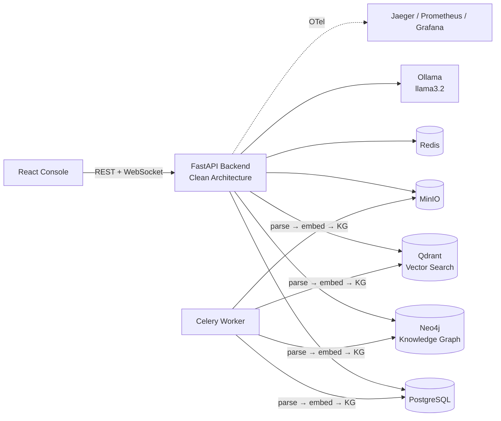

# Industrial Brain OS

**Industrial Brain OS** is a production-grade, AI-powered **Unified Asset &
Operations Brain** for industrial facilities. It ingests heterogeneous
engineering documents — P&IDs, SOPs, manuals, maintenance records, inspection
reports, regulations — and turns them into a queryable enterprise knowledge
platform: a hybrid GraphRAG retrieval engine, an interactive Knowledge Graph,
and five specialized intelligence "brains" (Knowledge, Maintenance,
Compliance, Root Cause Analysis, Lessons Learned).

Status: **M1–M20 complete** — see
[`docs/implementation_roadmap.md`](docs/implementation_roadmap.md) for the
full milestone-by-milestone build log, and
[`docs/manual/`](docs/manual/) for the complete engineering handbook.



---

## 📚 Documentation

**Start here:** [`docs/manual/`](docs/manual/) is the complete, verified
engineering handbook — installation, architecture, developer/admin/user
guides, API reference, deployment, and troubleshooting.

| Document | For |
|---|---|
| [**INSTALLATION.md**](docs/manual/INSTALLATION.md) | Getting a full local environment running (Windows/Linux/macOS) |
| [**ARCHITECTURE.md**](docs/manual/ARCHITECTURE.md) | How the system is built — layers, brains, KG, pipelines, PromptOps, security |
| [**DEVELOPER_GUIDE.md**](docs/manual/DEVELOPER_GUIDE.md) | Day-to-day dev tasks: add a document/brain/ontology entity, testing, resets |
| [**WORKFLOW.md**](docs/manual/WORKFLOW.md) | Branching, commits, PR checklist, CI, release process |
| [**API_REFERENCE.md**](docs/manual/API_REFERENCE.md) | Every endpoint, verified against the router source |
| [**ADMIN_GUIDE.md**](docs/manual/ADMIN_GUIDE.md) | User management, monitoring, performance tuning, security ops |
| [**USER_GUIDE.md**](docs/manual/USER_GUIDE.md) | Using the web console (non-technical) |
| [**DEPLOYMENT.md**](docs/manual/DEPLOYMENT.md) | Production deployment, checklist, backup/restore |
| [**TROUBLESHOOTING.md**](docs/manual/TROUBLESHOOTING.md) | Real issues hit during development, with verified fixes |
| [**FAQ.md**](docs/manual/FAQ.md) | Quick answers to common questions |

Source-of-truth architecture & governance documents:

- [Architecture Blueprint v2](docs/industrial_brain_architecture_v2.md)
- [Engineering Bible](docs/engineering_bible.md)
- [Architecture Decision Records (20 ADRs)](docs/architecture_decision_records.md)
- [Engineering Bible Compliance Self-Assessment](docs/bible_compliance.md)

---

## Quick Start

```bash
git clone <repo-url> industrial-brain && cd industrial-brain
cp .env.example .env

# Infrastructure (Postgres, Neo4j, Qdrant, Redis, MinIO, Jaeger, Prometheus, Grafana)
docker compose up -d

# Ollama (separate install — see docs/manual/INSTALLATION.md §9)
ollama pull llama3.2

# Backend
cd backend
python -m venv venv && venv\Scripts\Activate.ps1   # or: source venv/bin/activate
pip install -r requirements.txt
pip install -e ../shared/python
alembic upgrade head
python ../scripts/init_infra.py
uvicorn app.main:app --reload

# Celery worker (separate terminal, from backend/)
celery -A app.worker worker --loglevel=info

# Frontend (separate terminal)
cd frontend
pnpm install
pnpm run dev
```

Then open:
- Console: **http://localhost:3000**
- API docs: **http://localhost:8000/docs**
- Health check: **http://localhost:8000/api/v1/health**

Full, platform-specific instructions (including required AI models and
optional codebase-intelligence tooling) are in
[`docs/manual/INSTALLATION.md`](docs/manual/INSTALLATION.md).

---

## Project Structure

```
industrial-brain/
├── backend/     FastAPI service — Clean Architecture (domain/application/infrastructure/presentation)
├── frontend/    React 18 + Vite 6 + TypeScript console
├── shared/      Cross-service constants (Python + TypeScript packages)
├── ontology/    Industrial ontology schema (ISO 14224/15926 aligned)
├── datasets/    Golden QA dataset for the evaluation layer
├── monitoring/  Prometheus + Grafana provisioning
├── ci/          CI workflows (evaluation gate, PromptOps gate)
├── scripts/     Operational scripts (eval, prompt validation, demo data, benchmarks)
└── docs/        Architecture, ADRs, Engineering Bible, and the full manual (docs/manual/)
```

See [`docs/manual/ARCHITECTURE.md`](docs/manual/ARCHITECTURE.md#2-folder-structure)
for the full annotated tree.

---

## Key Capabilities

- **Hybrid GraphRAG retrieval** — BM25 + dense vector search + bounded
  Knowledge Graph traversal, cross-encoder reranked, context-compressed
  (LLMLingua), with citation-validated generation.
- **Five intelligence brains** — Knowledge, Maintenance, Compliance, Root
  Cause Analysis, and Lessons Learned, each a LangGraph agent with a
  step-limit guard and hallucination-resistant citation validation.
- **Async ingestion pipeline** — Celery task chain (parse → embed → KG
  extract) with automatic retry/backoff.
- **Evaluation layer** — a 22-item golden QA dataset scored for recall,
  precision, faithfulness, and hallucination rate, gating CI merges.
- **Full observability** — OpenTelemetry tracing (Jaeger), Prometheus
  metrics, two Grafana dashboards.
- **PromptOps** — every LLM prompt is a schema-validated, version-controlled
  YAML file; a CI gate rejects hardcoded prompts.
- **Premium web console** — React 18 + Vite + Tailwind design system with an
  interactive Cytoscape Knowledge Graph visualizer and a PDF citation viewer.

---

## Development Workflow

```bash
make lint      # black, ruff, eslint
make format    # auto-format backend + frontend
make test      # backend pytest suite
make coverage  # pytest with coverage report
make eval      # RAG evaluation suite (writes docs/eval_baseline.json)
make validate-prompts   # PromptOps schema/manifest gate
make security-audit     # bandit + pip-audit + pnpm audit
make benchmark           # API latency benchmark
```

Windows users without `make` can run the underlying commands directly, or use
`./run.ps1` for the reduced command set it exposes (`install`, `dev`, `lint`,
`format`, `test`, `up`, `down`, `clean`).

**Branching**: `feature/<name>`, `bugfix/<name>`, `hotfix/<name>`,
`docs/<name>` — short-lived, off `main`.
**Commits**: [Conventional Commits](https://www.conventionalcommits.org/) —
`feat(<scope>): <description>`, `fix(<scope>): <description>`, etc.

Full workflow, PR checklist, and release process:
[`docs/manual/WORKFLOW.md`](docs/manual/WORKFLOW.md).

---

## License

See [`LICENSE`](LICENSE).
