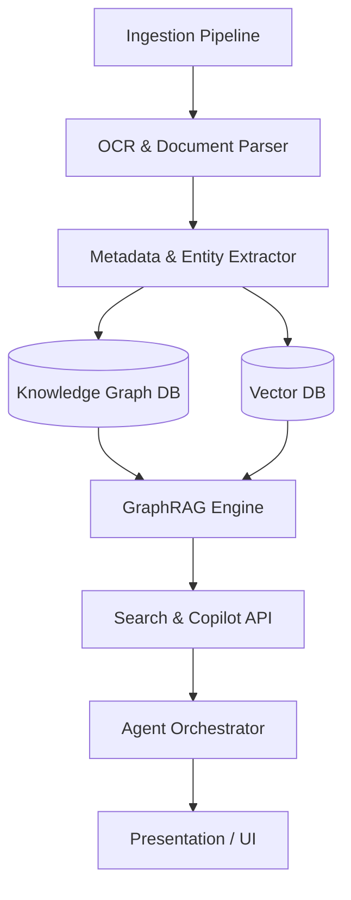

# Industrial Brain OS: Architectural Specification
## Unified Asset & Operations Brain for Industrial Knowledge Intelligence

---

## Step 1: Requirements, Actors, Data Sources, and Constraints

### 1.1 Requirements
| Category | Requirement ID | Description |
| :--- | :--- | :--- |
| **Functional** | FR-01 | **Heterogeneous Document Ingestion**: Ingest and process PDF manuals, datasheets, standard operating procedures (SOPs), legacy logbooks, and text files. |
| | FR-02 | **OCR & Engineering Drawing Understanding**: Extract structural data from scans and parse schematic diagrams, Piping and Instrumentation Diagrams (P&IDs), and electrical drawings (extracting components, symbols, and connections). |
| | FR-03 | **Knowledge Graph & Entity Extraction**: Automatically extract industrial entities (assets, sensors, procedures, failure modes) and establish relations (e.g., *Asset-isPartOf-System*, *Sensor-monitors-Asset*). |
| | FR-04 | **GraphRAG & Semantic Search**: Combine vector-based semantic search with graph-based relational retrieval to answer complex multi-hop queries (e.g., "Find all valves upstream of Tank-02 that have history of fatigue failure"). |
| | FR-05 | **AI Copilot & Root Cause Analysis (RCA)**: Assist operators in diagnosing active alarms, matching failure signatures with historical maintenance logs and RCA templates (e.g., 5 Whys, Ishikawa). |
| | FR-06 | **Compliance & Lessons Learned Engine**: Cross-reference operating procedures with safety regulations and capture post-incident reviews to recommend preventive actions. |
| **Non-Functional** | NFR-01 | **Security & Isolation**: Strict role-based access control (RBAC) and document-level security so operators only query data they are authorized to access. |
| | NFR-02 | **Traceability & Auditability**: Every AI recommendation must cite the exact source document, page, or knowledge graph node. Comprehensive audit logging for all compliance checks. |
| | NFR-03 | **Performance & Latency**: P50 latency for semantic search and simple queries < 500ms; GraphRAG synthesis < 3000ms. |
| | NFR-04 | **Scalability**: Capable of indexing 100k+ engineering drawings and manuals without degradation in retrieval performance. |
| | NFR-05 | **Robust Offline Capability**: Support deployments in air-gapped industrial environments using local/on-prem LLMs and databases. |

### 1.2 Users & Actors
- **Field Maintenance Technician**: Queries the AI Copilot on-site to get maintenance steps, lookup P&IDs, or diagnose asset failures.
- **Operations Manager**: Reviews overall plant performance, safety compliance checks, and cross-asset lessons learned.
- **Reliability Engineer**: Conducts Root Cause Analysis (RCA) and inputs lessons learned back into the system.
- **Compliance Officer**: Reviews audits, automated compliance checks, and verifies conformity to national/international standards (e.g., OSHA, ISO).
- **System Administrator**: Manages data pipelines, user roles, system metrics, and ontological schemas.

### 1.3 Data Sources
1. **Engineering Documents**: P&IDs, CAD outputs, datasheets, ISO standards, and OEM manuals (PDF, DXF, DWG).
2. **Operations & Maintenance Logs**: CMMS (Computerized Maintenance Management System) histories, work orders, shift handovers (SQL database, CSV).
3. **Real-time & Historian Data**: Sensor metadata, SCADA tag definitions, and alarm hierarchies (OPC-UA metadata, TSDB catalogs).
4. **Regulatory Standards**: Regulatory publications, safety guidelines, and compliance rules (PDF, XML).

### 1.4 Constraints, Risks & Assumptions
- **Constraints**: Must be deployable on-premises or in private clouds; must prioritize open-source or free-tier technologies for prototype viability.
- **Risks**: Hallucinations in LLM output can lead to incorrect maintenance actions, posing severe physical safety hazards. Poor scan quality on legacy P&IDs can yield high OCR error rates.
- **Assumptions**: Availability of edge/server-grade hardware (GPUs) for running local model inference if deployed in an air-gapped configuration.

---

## Step 2: Major Subsystems & Responsibilities



### 2.1 Subsystem Catalog
1. **Heterogeneous Document Ingestion**: Ingests files from folders, object stores, and APIs. Normalizes file formats and handles file-level queuing.
2. **OCR & Schematic Parser**: Extracts raw text, layout coordinates, and uses computer vision models to detect shapes, text blocks, and connections in engineering drawings (P&IDs).
3. **Metadata & Entity Extraction (IE)**: Extracts key industrial concepts (e.g., ISO tags, Equipment IDs, Process variables) and relations via Named Entity Recognition (NER) and Relation Extraction (RE).
4. **Knowledge Graph (KG) Manager**: Maintains the system ontology, handles node updates, deletes, and ensures data consistency across the graph database.
5. **Embedding & Vector Pipeline**: Generates chunked texts, computes vector embeddings, and synchronizes them with the vector database.
6. **GraphRAG Engine**: Performs hybrid search (vector search + graph traversal) and formats context windows for structured LLM reasoning.
7. **AI Copilot & Agent Framework**: Executes tasks (e.g., RCA generation, compliance analysis) using specialized workflows and memory managers.
8. **Authentication & Audit**: Governs access control (RBAC), API rate-limiting, and logs all prompts, retrievals, and actions for compliance audits.

---

## Step 3: Clean Architecture Design

We divide the application into six layers to ensure separation of concerns, testability, and independence from frameworks or delivery mechanisms.

```
┌─────────────────────────────────────────────────────────────┐
│                       PRESENTATION                          │
│         (React / Web App, Operators Dashboard, CLI)         │
├─────────────────────────────────────────────────────────────┤
│                        APPLICATION                          │
│    (Use Cases: RCA Agent, Compliance Verification, Search)  │
├─────────────────────────────────────────────────────────────┤
│                          AI LAYER                           │
│        (GraphRAG, LLM Interface, Agent Orchestrator)        │
├─────────────────────────────────────────────────────────────┤
│                           DOMAIN                            │
│        (Ontologies, Entities, Value Objects, Specs)         │
├─────────────────────────────────────────────────────────────┤
│                       INFRASTRUCTURE                        │
│   (Object Storage Client, Relational Repositories, Logs)    │
├─────────────────────────────────────────────────────────────┤
│                         DATA LAYER                          │
│     (PostgreSQL, Neo4j Graph DB, Qdrant Vector Store)       │
└─────────────────────────────────────────────────────────────┘
```

- **Presentation**: Handles user interfaces, rendering, and API response formatting.
- **Application**: Implements orchestration logic and core business use cases (e.g., executing an RCA wizard, checking a document for compliance).
- **AI Layer**: Manages cognitive constructs, prompt layouts, vectorization, and agent states.
- **Domain**: Pure business rules, data structures, and ontology mappings. Contains no references to external databases or web frameworks.
- **Infrastructure**: Concrete implementations of gateways, storage drivers, databases, and network clients.
- **Data Layer**: The actual storage instances holding the physical records.

---

## Step 4: Repository Layout Strategy

To allow parallel development by specialized engineering sub-teams, the project is structured as a multi-repo ecosystem:

| Repository Name | Focus Area | Description |
| :--- | :--- | :--- |
| `industrial-brain-monorepo` | Platform Core | Houses the `frontend` (React dashboard), `backend` (FastAPI core/application layers), and `shared` (interfaces, domain logic, and validation schemas). |
| `industrial-brain-research` | AI & CV Research | Jupyter notebooks, model training scripts for P&ID detection, and model evaluation protocols. |
| `industrial-brain-promptops` | Cognitive Config | Version-controlled prompt templates, system instructions, and LLM evaluation criteria. |
| `industrial-brain-infra` | Deployment | Docker Compose, Helm charts, Terraform configurations, and deployment playbooks. |
| `industrial-brain-datasets` | Data Assets | Mock manuals, P&ID images, synthetic engineering ontologies, and golden datasets for verification. |

---

## Step 5: Directory Structure (Folder Schema)

```
industrial-brain-monorepo/
├── apps/
│   ├── backend/
│   │   ├── src/
│   │   │   ├── presentation/
│   │   │   │   ├── api/
│   │   │   │   └── websockets/
│   │   │   ├── application/
│   │   │   │   ├── use_cases/
│   │   │   │   └── services/
│   │   │   ├── domain/
│   │   │   │   ├── entities/
│   │   │   │   ├── value_objects/
│   │   │   │   └── repositories/
│   │   │   ├── infrastructure/
│   │   │   │   ├── persistence/
│   │   │   │   ├── ocr/
│   │   │   │   └── parsing/
│   │   │   ├── ai/
│   │   │   │   ├── agents/
│   │   │   │   ├── prompts/
│   │   │   │   └── graphrag/
│   │   │   └── config/
│   │   └── tests/
│   └── frontend/
│       ├── src/
│       │   ├── components/
│       │   ├── hooks/
│       │   ├── pages/
│       │   ├── services/
│       │   ├── styles/
│       │   └── types/
│       └── public/
├── packages/
│   └── shared/
│       ├── src/
│       │   ├── dto/
│       │   ├── schemas/
│       │   └── utils/
│       └── package.json
└── docs/
    ├── architecture/
    └── api/
```

---

## Step 6: External & Internal Services Map

| Service Category | Selected Engine | Purpose / Justification |
| :--- | :--- | :--- |
| **Vector DB** | Qdrant / pgvector | Store and index text embeddings for rapid semantic chunk lookup. |
| **Knowledge Graph DB** | Neo4j Community / Apache AGE | Manage entity-relationship models of assets, systems, and procedures. |
| **Object Storage** | MinIO | Store ingested PDFs, extracted image components, and raw document files. |
| **Relational DB** | PostgreSQL | Store application states, audit logs, user credentials, configurations, and transactional data. |
| **LLM Provider** | Ollama (Local) / Gemini API | Support offline/local hosting using Llama 3/Mistral, or scale with API-driven Gemini architectures. |
| **Embedding Engine** | Hugging Face (Local) / Ollama | Generate dense representations using models like `bge-large-en` or `nomic-embed-text`. |
| **OCR & Layout Engine** | Tesseract OCR + LayoutParser | Extract texts and layout structures from PDF/image pages. |
| **Observability** | OpenTelemetry + Prometheus / Grafana | Trace agent execution paths, monitor token usage, track query latency, and record error rates. |

---

## Step 7: Technology Stack Recommendation (100% Free & Open Source)

```
┌────────────────────────────────────────────────────────┐
│                        FRONTEND                        │
│             React.js + TailwindCSS + Vite              │
└──────────────────────────┬─────────────────────────────┘
                           │ API Call
┌──────────────────────────▼─────────────────────────────┐
│                        BACKEND                         │
│           Python + FastAPI + LangChain/LangGraph       │
└──────┬───────────────────┬───────────────────┬─────────┘
       │ Writes Logs       │ Vectors           │ Graph Queries
┌──────▼───────────┐ ┌─────▼───────────┐ ┌─────▼─────────┐
│  RELATIONAL &    │ │    VECTOR DB    │ │  GRAPH DB     │
│   AUDIT STORE    │ │                 │ │               │
│    PostgreSQL    │ │  Qdrant / PG    │ │ Neo4j Comm. / │
│   (with Timescale)││    (vector)     │ │  Apache AGE   │
└──────────────────┘ └─────────────────┘ └───────────────┘
```

1. **Backend Framework: FastAPI (Python)**
   - *Why*: High-performance asynchronous execution, automatic OpenAPI generation, and rich integration with ML tools.
2. **Orchestrator: LangChain & LangGraph**
   - *Why*: Provides flexible DAG execution topologies, permitting complex agent state machine implementations like iterative RCA workflows.
3. **Vector Database: Qdrant (Open Source Edition)**
   - *Why*: Efficient, developer-friendly, supports payload filtering (crucial for RBAC/metadata containment), and offers robust performance profiles.
4. **Graph Database: Neo4j Community Edition**
   - *Why*: Cypher query language is the de facto standard; offers optimized graph query execution and native integration with langchain-community graph tools.
5. **Relational Database: PostgreSQL**
   - *Why*: Industrial-grade durability, excellent indexing capabilities, and expandable to time-series datasets via TimescaleDB for telemetry metadata.
6. **Object Storage: MinIO**
   - *Why*: S3-compatible local server, easy to configure, fast, and secure.
7. **Document Extraction: PyMuPDF + PaddleOCR**
   - *Why*: Outstanding performance with tabular layouts, scan detection, and engineering texts.
8. **Inference Server: Ollama / vLLM**
   - *Why*: Hosts model runtimes (e.g., Llama-3-8B-Instruct) locally with minimal configuration and zero cost.

---

## Step 8: Development Roadmap & Milestones

```
Phase 1: Ingestion & Vector Base (Weeks 1-2)
  ├── Setup Postgres, MinIO, Qdrant
  └── Implement document parser, OCR, basic semantic search
Phase 2: Knowledge Graph Integration (Weeks 3-4)
  ├── Launch Neo4j container
  └── Implement Entity/Relation Extraction pipeline
Phase 3: Cognitive & GraphRAG Layer (Weeks 5-6)
  ├── Build GraphRAG search orchestrator
  └── Integrate local/cloud LLMs with hybrid retrieval
Phase 4: Agentic Use Cases & RCA (Weeks 7-8)
  ├── Implement RCA & Compliance agents via LangGraph
  └── Build React Frontend, charts, & Chat Interface
Phase 5: Auditing, Hardening & Evaluation (Weeks 9-10)
  ├── Implement RBAC & audit logging engines
  └── Conduct model/system performance benchmarking
```

### 8.1 Detail Checklist
- [ ] **M1: Foundation**: Spin up local/dockerized core storage services (Postgres, Qdrant, MinIO, Neo4j).
- [ ] **M2: Chunking & Embedding**: Validate PDF parsing, OCR alignment, and ingestion into the vector store.
- [ ] **M3: Graph Construction**: Verify schema properties, build entity nodes, and link processes using LLM-in-the-loop schema builders.
- [ ] **M4: Hybrid Search Integration**: Validate combined query outputs from Qdrant and Neo4j.
- [ ] **M5: UI & Copilot Integration**: Establish WebSockets connection for live streaming chat responses and visual P&ID schema highlight overlays.
