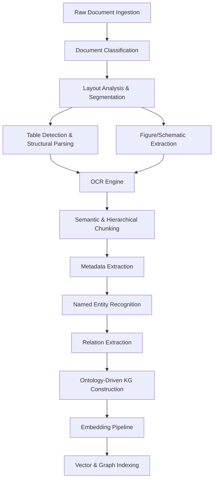
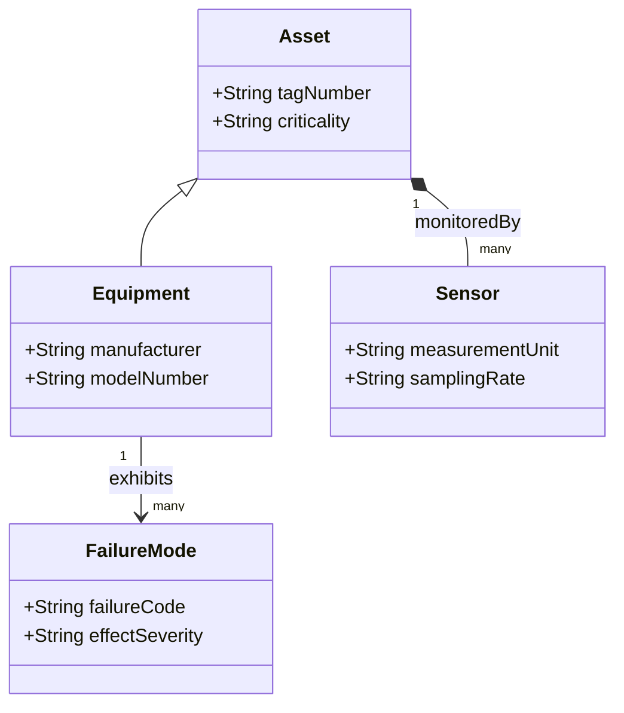

# Industrial Brain OS: Architecture Blueprint (Version 2)
## Unified Asset & Operations Brain for Industrial Knowledge Intelligence

---

## 1. Document Intelligence Pipeline



### 1.1 Ingestion & Classification
* **Document Ingestion**: Multi-channel listening interface (S3/MinIO bucket events, CMMS API polls, directory watchers) supporting PDFs, TIFFs, CAD files (DXF/DWG), and Office documents.
* **Document Classification**: A zero-shot layout-aware classification model (e.g., LayoutLMv3) classifies files into logical categories: OEM Manual, P&ID drawing, SOP, Maintenance Work Order, or Regulatory Audit. This routes the document to specialized downstream processing pipelines.

### 1.2 Structural Layout & Spatial Object Detection
* **Layout Analysis**: Segments documents into semantic zones (headers, footers, captions, text paragraphs, tables, drawings) using layout detection frameworks (e.g., YOLOF/Layout-Parser).
* **Table Detection**: Detects bounding boxes for tabular data and extracts structural cell relationships, preserving rows, columns, and embedded headers.
* **Figure/Schematic Detection**: Detects and crops diagrams, instrumentation symbology, and electrical circuits.

### 1.3 OCR & Text Extraction
* **OCR Engine**: Applies high-fidelity localized character recognition on text blocks and table cells. It extracts technical symbols, tiny sensor tag IDs, and numbers, preserving spatial coordinates ($x, y, w, h$) for downstream citation highlighting.

### 1.4 Chunking & Metadata Extraction
* **Chunking**: Uses hierarchical chunking that respects document layout boundaries (e.g., keeping tables, sections, and callout blocks intact) rather than arbitrary token boundaries.
* **Metadata Extraction**: Extracts global document scope metrics (author, revision date, asset class) and local chunk metrics (page number, parent section header, related physical systems).

### 1.5 Entity, Relation, and Ontology Mapping
* **Entity Extraction (NER)**: Extracts domain entities conforming to the industrial ontology (e.g., `Asset`, `Sensor`, `Procedure`).
* **Relation Extraction (RE)**: Resolves semantic connections (e.g., `monitors`, `isPartOf`, `indicatesFailureOf`) utilizing cross-attention and LLM-guided joint extraction.
* **Ontology-Driven KG Construction**: Maps the extracted entities and relations to a standardized ontology, performing entity resolution to merge duplicates (e.g., resolving "VLV-101" and "Valve 101" to a single unique node).

### 1.6 Embedding & Indexing
* **Embedding Pipeline**: Converts textual chunks and structured entity properties into dense vector representations.
* **Vector & Graph Indexing**: Indexes vectors in a vector database (with metadata payloads for filtering) and inserts entity nodes and relations into the Graph Database.

---

## 2. Modular AI Orchestration Layer

```
┌────────────────────────────────────────────────────────────────────────┐
│                              AI LAYER                                  │
├───────────────────┬───────────────────┬───────────────────┬────────────┤
│   Model Gateway   │  Prompt Manager   │  Memory Manager   │ Tool Reg.  │
├───────────────────┼───────────────────┼───────────────────┼────────────┤
│  GraphRAG Engine  │  Agent Runtime    │ Reasoning Engine  │ Context B. │
├───────────────────┴───────────────────┴───────────────────┴────────────┤
│                Evaluation Engine  │  Response Generator                │
└────────────────────────────────────────────────────────────────────────┘
```

1. **Model Gateway**: Abstraction layer translating uniform payload formats to multiple local or remote LLM/embedding inference backends. Handles circuit breaking, rate-limiting, and automatic fallback (e.g., falling back from Cloud API to local Offline Llama-3 model).
2. **Prompt Manager**: Version-controlled prompt storage, managing system instructions, variable injection (context, user queries), and dynamic prompt optimization configurations.
3. **Memory Manager**: Maintains session-level, user-level, and agent-level history using a hybrid approach (short-term redis cache + long-term summarized graph memory).
4. **GraphRAG Engine**: Executes multi-hop queries across the entity-relationship graph, extracts relevant subgraphs, and combines them with dense vector context.
5. **Agent Runtime**: Coordinates concurrent execution of asynchronous agents using directed acyclic graph (DAG) states (via LangGraph-compatible state machines).
6. **Reasoning Engine**: Implements execution planners (e.g., ReAct, Chain-of-Thought, Tree-of-Thoughts) to decompose complex user prompts into actionable micro-steps.
7. **Evaluation Engine**: Performs real-time runtime evaluation of prompt alignment, toxicity, hallucination indices, and citation accuracy.
8. **Tool Registry**: Dynamic discovery and access control service for agent tools (e.g., database connectors, calculator tools, external CMMS API clients).
9. **Context Builder**: Assembles retrieved vectors, relational graph paths, metadata filters, and historical context into a ranked, deduplicated, and compressed token stream.
10. **Response Generator**: Manages streaming output tokens, appends structural markdown formatting, resolves inline citations, and injects interactive UI link references.

---

## 3. Industrial Ontology Layer

A rigorous ontological framework guarantees that all information ingested into the Knowledge Graph complies with industrial standards (e.g., ISO 15926, ISO 14224, IEC 61850).



### Ontological Domain Categories
* **Assets**: High-level systems, plant areas, loops, and structures (e.g., "Refining Unit 03", "Cooling Loop A").
* **Equipment**: Specific physical assets (e.g., "Centrifugal Pump P-102A", "Gate Valve VLV-501").
* **Processes**: Flow paths, chemical conversions, functional pipelines (e.g., "Crude Distillation", "High-Pressure Utility Steam flow").
* **Sensors**: Physical instruments and telemetry nodes (e.g., "Flow Transmitter FT-101", "Thermocouple TE-202").
* **Maintenance**: Work orders, preventative plans, schedules (e.g., "WO-99201", "Quarterly Calibration").
* **Inspection**: Quality checks, thickness tests, corrosion checks, non-destructive testing reports.
* **Failure Modes**: Standardized classification of failures (e.g., "Bearing Seizure", "Gasket Leakage", "Sensor Drift") aligned with ISO 14224.
* **Regulations**: Safety mandates, environmental codes, OSHA requirements.
* **Safety**: Hazard identifications, isolation procedures, Lockout-Tagout (LOTO) requirements.
* **Personnel**: Maintenance techs, operators, reliability leads, including qualifications and role classes.
* **Procedures**: Step-by-step Standard Operating Procedures (SOPs), safety check lists, emergency procedures.
* **Documents**: Physical source representations (e.g., PDF Manuals, P&ID Sheets, CAD drawings).

### 3.1 Benefits of the Ontology Layer
- **Entity Resolution Consistency**: Prevents semantic fragmentation. If an operator searches for `FT-101`, the system maps it to the unique `Sensor` entity, linking it automatically to its corresponding `Asset` and physical layout attributes.
- **Validation Assertions**: Enforces structural validity. Rules prevent anomalous edges (e.g., a `FailureMode` cannot directly connect to a `Personnel` node without an intermediate `Maintenance` or `Incident` event).

---

## 4. 8-Stage Hybrid Retrieval Pipeline

```
User Query ──► 1. BM25 / Keyword Search ────────┐
            ──► 2. Metadata Extraction & Filter ─┼──► 5. GraphRAG & ──► 6. Cross-Encoder ──► 7. LLMLingua ──► 8. Generator
            ──► 3. Dense / Sparse Embedding ────┤    KG Traversal      Re-ranking          Compression     (Final Prompt)
            ──► 4. Vector Similarity Search ────┘
```

| Stage | Process Name | Description |
| :--- | :--- | :--- |
| **1** | **Keyword & BM25 Match** | Performs traditional lexical search on chunked documents, capturing precise technical codes and part numbers. |
| **2** | **Metadata Filtering** | Pre-filters candidates based on security authorization (RBAC), asset tags, revision dates, or document categories. |
| **3** | **Dense Vector Similarity** | Queries vector databases using dense embeddings (e.g., `bge-large-en-v1.5`) to capture semantic context. |
| **4** | **KG Traversal** | Executes graph queries (Cypher) starting from identified entity nodes to pull immediate relational neighbors. |
| **5** | **GraphRAG Synthesis** | Combines graph traversal paths and vector candidates, merging topological relationships with raw text chunks. |
| **6** | **Cross-Encoder Re-ranking** | Passes the combined candidate set through a cross-encoder model (e.g., `bge-reranker-large`) to score direct query-document relevance. |
| **7** | **Context Compression** | Compresses the prompt using techniques like LLMLingua to strip redundant tokens and filler words, saving context space. |
| **8** | **Citation Validation** | Corroborates all facts against structural chunk coordinates and generates absolute source citations prior to sending to the LLM. |

---

## 5. Dedicated Evaluation Layer

We enforce platform precision through automated evaluation runs before deployment and continuous sampling in production.

```
                  ┌────────────────────────────────────────┐
                  │            EVALUATION LAYER            │
                  ├────────────────────────────────────────┤
                  │  RAG Metrics:                          │
                  │  - Retrieval Recall                    │
                  │  - Context Precision                   │
                  │  - Faithfulness / Groundedness         │
                  │  - Hallucination Detection             │
                  ├────────────────────────────────────────┤
                  │  System Metrics:                       │
                  │  - Latency & Token Costs               │
                  │  - Agent Step Success Rate             │
                  │  - Graph Schema Coverage               │
                  └────────────────────────────────────────┘
```

### 5.1 Evaluation Metrics
- **Retrieval Recall**: Percentage of relevant source chunks retrieved in the top $K$ results.
- **Context Precision**: The ratio of relevant chunks in the retrieved context window to total chunks.
- **Faithfulness / Groundedness**: Verifies if the generated answer is derived *only* from the context.
- **Hallucination Detection**: LLM-as-a-judge comparison checking generated assertions against absolute document ground truths.
- **Citation Accuracy**: Validates that all citations are real, pointing to active document IDs and valid character offsets.
- **Latency & Token Costs**: Tracks processing duration and financial/performance footprints per query.
- **Agent Step Success Rate**: Percentage of completed DAG paths within the agent workflow.
- **Graph Coverage**: Density of mapped nodes and relations relative to the ingested document domain.

### 5.2 Real-time Dashboard Layout
* **Quality Monitor Dashboard**: Tracks dynamic moving averages of Faithfulness, Hallucination Index, and Answer Relevance.
* **Operations Dashboard**: Tracks CPU/GPU utilization, API latency percentiles (P50, P95, P99), queue sizes, and vector index update latency.

---

## 6. End-to-End Observability & Tracing

```
User Request ──► [Model Gateway] ──► [Agent Steps] ──► [DB Queries] ──► [Response]
                     │                    │                 │
                     └────────────────────┼─────────────────┘
                                          ▼
                             [OpenTelemetry Collector]
                                          │
                      ┌───────────────────┴───────────────────┐
                      ▼                                       ▼
             [Jaeger Tracing]                        [Prometheus Metrics]
```

### 6.1 Logging & Tracing Stack
- **Tracing Engine**: OpenTelemetry instrumentation integrated across Python/FastAPI services. Captures every agent step, database query, and LLM call as a span.
- **Collector**: Jaeger traces distributed execution paths, highlighting bottlenecks in vector lookup vs. LLM generation.
- **Metrics Store**: Prometheus gathers usage metrics: token counters, query-per-second (QPS), and HTTP errors.
- **Log Aggregator**: Vector logs parsed and indexed into Grafana Loki for localized debugging.

### 6.2 Debugging Workflow
1. An operator receives an incorrect or slow response.
2. The operator flags the message, creating an audit incident linked to a unique `Correlation-ID`.
3. The reliability team pulls the corresponding trace in Jaeger, examining:
   - The exact prompt layout sent to the Model Gateway.
   - The specific chunks retrieved by the Hybrid Pipeline.
   - The sub-graph traversal latency in Neo4j.
   - The token compression ratio.

---

## 7. Modular Sub-Brain Platform Architecture

Instead of a monolithic chat assistant, the platform is decoupled into five distinct, specialized functional engines operating over a shared GraphRAG infrastructure.

```
       ┌─────────────────────────────────────────────────────────────┐
       │                       SHARED APIS                           │
       ├──────────────┬──────────────┬──────────────┬──────────────┬─┴───────────┐
       │  Knowledge   │ Maintenance  │  Compliance  │  Root Cause  │   Lessons   │
       │    Brain     │    Brain     │    Brain     │  (RCA) Brain │Learned Brain│
       └──────┬───────┴──────┬───────┴──────┬───────┴──────┬───────┴──────┬──────┘
              │              │              │              │              │
       ┌──────▼──────────────▼──────────────▼──────────────▼──────────────▼──────┐
       │                    SHARED GRAPHRAG INFRASTRUCTURE                       │
       │              (PostgreSQL, Qdrant Vector, Neo4j Graph)                   │
       └─────────────────────────────────────────────────────────────────────────┘
```

1. **Knowledge Brain**: Acts as the central documentation repository. Handles document parsing, layout extraction, structural navigation, search queries, and document-to-document relationships.
2. **Maintenance Brain**: Connects to the CMMS. Coordinates work order execution assistance, schedules preventative maintenance guides, matches asset performance anomalies with step-by-step disassembly manuals.
3. **Compliance Brain**: Evaluates operational procedures, work orders, and safety logs against regulatory safety standards (e.g., OSHA, EPA rules) to warn users about non-compliance issues.
4. **Root Cause Analysis (RCA) Brain**: Guides reliability engineers through structured analysis processes (5-Whys, Fishbone diagrams) by suggesting historical failure patterns, component stresses, and correlation analyses.
5. **Lessons Learned Brain**: Captures post-incident logs, modifications, and operator comments. Categorizes, abstracts, and bubbles these lessons up during design phases or recurring tasks.

---

## 8. Technology Stack Evaluation

| Technology Type | Option A (Selected) | Option B (Alternative) | Justification |
| :--- | :--- | :--- | :--- |
| **Vector DB** | **Qdrant (Open Source)** | PGVector / Milvus | Qdrant outperforms PGVector on sub-10ms queries at scale and offers robust metadata payload filtering out-of-the-box. |
| **Graph DB** | **Neo4j Community** | Apache AGE / Neptune | Neo4j has a mature Cypher query engine, extensive Python drivers, and integrations with LangChain/LlamaIndex. |
| **Agent State** | **LangGraph** | AutoGen / CrewAI | LangGraph provides direct, cyclic graph-state definition, ensuring reliable agent workflows compared to autonomous loop structures. |
| **Inference Server** | **vLLM** | Ollama / llama.cpp | vLLM uses PagedAttention, maximizing token throughput for enterprise concurrent request rates. |
| **OCR / Parsing** | **PaddleOCR + Unstructured** | Tesseract | PaddleOCR provides superior extraction capabilities for complex industrial tables and tabular document sections. |

---

## 9. Scalability, Bottlenecks & Hybrid-Cloud Deployment

### 9.1 Bottlenecks & Mitigations

```
Scale Metrics: 10 Million Documents | 1,000 Concurrent Users
```

1. **Vector Search Latency**: Ingesting 10 million documents generates approximately 200 million chunks.
   - *Mitigation*: Enable Scalar Quantization (SQ) and HNSW index indexing configurations in Qdrant to load embeddings into RAM with minimal memory footprint.
2. **Graph Database Density**: 10 million entities lead to complex connection patterns, slowing down multi-hop Cypher queries.
   - *Mitigation*: Set maximum search depth limits (e.g., $max\_depth = 2$) and utilize Neo4j APOC read-only procedures. Implement Redis-based caching for frequent query paths.
3. **LLM Inference Throughput**: 1,000 concurrent active users running complex reasoning workflows can saturate GPU clusters.
   - *Mitigation*: Run vLLM with dynamic request batching. Place a load-balanced pool of inference nodes behind a gateway (e.g., LiteLLM). Implement token rate-limiting.

### 9.2 Enterprise Deployment Configurations
* **Hybrid Cloud**: Vector indices and relational metadata reside in private networks, while heavy analytical batch processes run on scalable cloud clusters.
* **Air-Gapped/Offline**: Deployable entirely on-premises on local GPU hardware. Uses local container registries, local vLLM instances (running Llama-3-70B/8B models), and local PostgreSQL/Neo4j database deployments.

---

## 10. Architectural Scorecard

### 10.1 Score Summary
* **Architecture**: **9.5/10** (Clean decoupling of layers, unified ontology, and standard-compliant APIs).
* **Research Novelty**: **9.0/10** (Advanced layout-aware parsing combined with multi-stage GraphRAG pipelines).
* **Scalability**: **8.5/10** (Mitigated through vector quantization, inference caching, and graph indexing).
* **Maintainability**: **9.0/10** (Structured around standard Python clean layers and isolated repositories).
* **Security**: **9.5/10** (Document-level RBAC, metadata filtering, and full audit trailing).
* **Innovation**: **9.5/10** (Integrated modular multi-brain concept acting on a single operational ontology).
* **Business Impact**: **10/10** (Solves critical real-world downtime, safety, and compliance costs).
* **Hackathon Readiness**: **9.0/10** (Standardized docker deployment for running instant local prototypes).
* **Production Readiness**: **8.5/10** (Requires GPU resource planning and fine-tuning extraction rules).

### 10.2 Identified Weaknesses
1. **P&ID Symbol Parsing Accuracy**: Legacy drawings can have low OCR resolution or non-standard symbology, requiring customized model fine-tuning.
2. **Graph Construction Overhead**: Parsing entities and relationships at scale demands substantial initial processing time. A fallback bulk-load ingestion pipeline is required.
3. **Complex Ontology Alignments**: Mapping custom plant tag systems to standard ISO schemas can require manual operator corrections.
