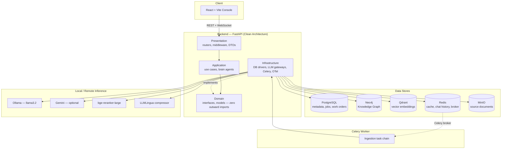
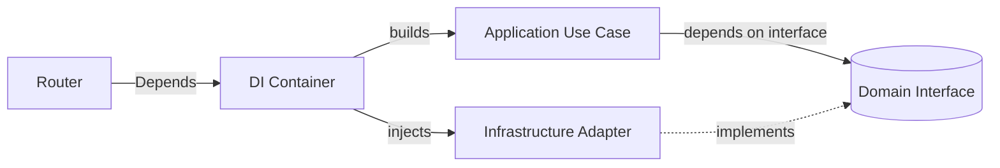
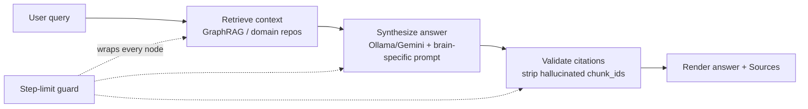
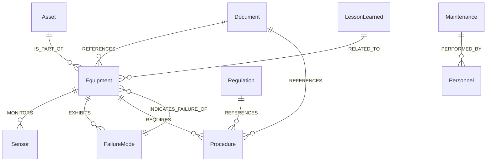
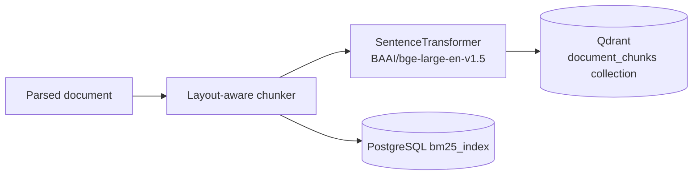
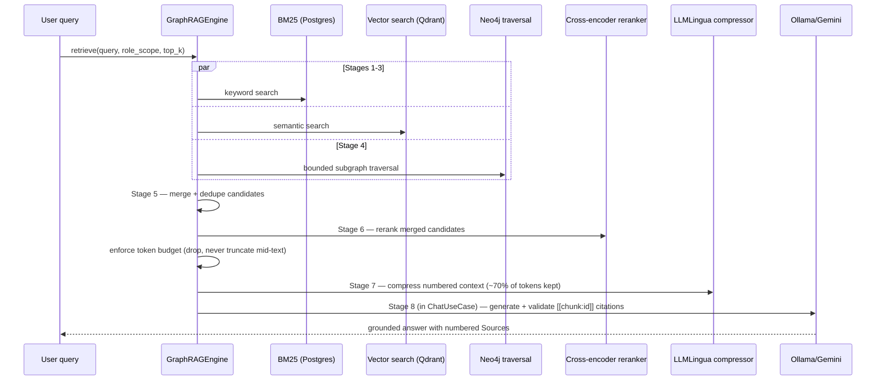
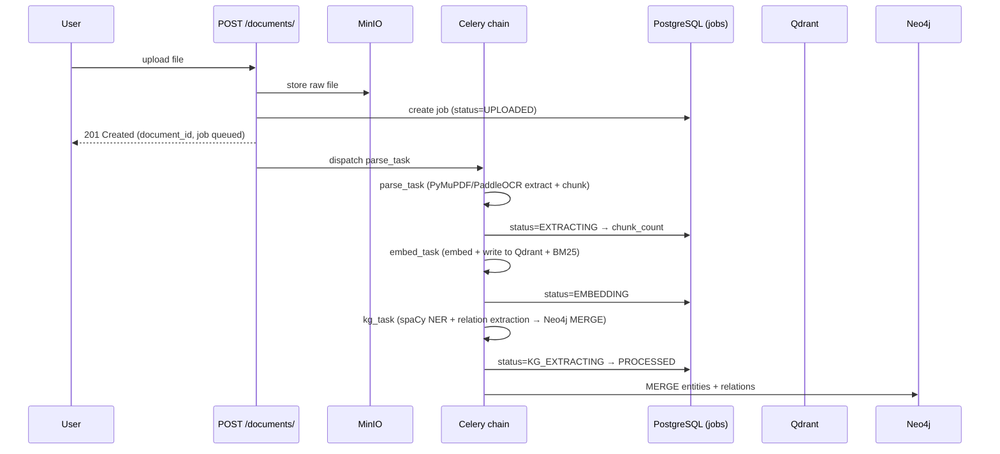
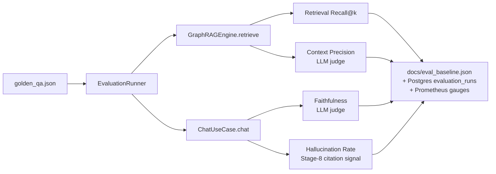
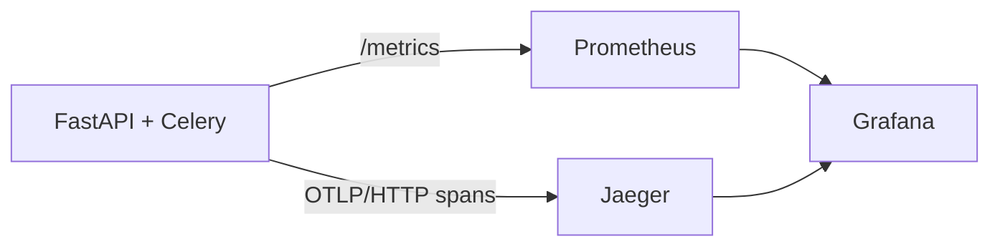
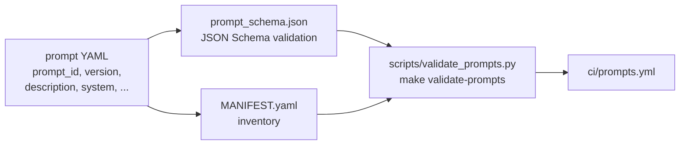

# Architecture Guide

This document explains how Industrial Brain OS is put together: the layering
rules, the folder structure, the five intelligence "brains," the Knowledge
Graph, and the four major pipelines (embedding, GraphRAG retrieval, Celery
ingestion, evaluation). It is the technical companion to
[`docs/industrial_brain_architecture_v2.md`](../industrial_brain_architecture_v2.md)
(the original architecture blueprint) and
[`docs/architecture_decision_records.md`](../architecture_decision_records.md)
(the 20 ADRs explaining *why* each technology was chosen).

---

## 1. Project Architecture

Industrial Brain OS is a monorepo: a FastAPI backend, a React/Vite frontend,
and a shared contracts package, backed by five specialized data stores.



### Clean Architecture layers (ADR-013, ADR-014)

The backend (`backend/app/`) is organized into four layers with a strict
dependency rule: **inner layers never import outer layers.**

| Layer | Path | Contains | May import |
|---|---|---|---|
| **Domain** | `app/domain/` | Entities, value objects, and `Interface`/port `ABC`s per bounded context (`auth`, `chat`, `document`, `graphrag`, `knowledge_brain`, `maintenance_brain`, `compliance_brain`, `rca_brain`, `lessons_brain`, `evaluation`, `extraction`, `ontology`, `search`) | Nothing outward — enforced by `backend/tests/test_architecture.py` (ADR-013 guard) |
| **Application** | `app/application/` | Use cases and the five LangGraph brain agents; orchestrates domain ports | Domain only |
| **Infrastructure** | `app/infrastructure/` | Concrete adapters: Postgres/Neo4j/Qdrant/Redis/MinIO clients, Ollama/Gemini gateways, Celery tasks, OpenTelemetry, prompt loader | Domain (implements its interfaces) |
| **Presentation** | `app/presentation/` | FastAPI routers, request/response DTOs, middleware, auth dependency | Application, via the DI container |

Wiring between layers happens in one place: the dependency-injection
container, `backend/app/infrastructure/di/container.py`. Routers call
`container.get_<use_case>()` — they never construct infrastructure objects
directly.



---

## 2. Folder Structure

```
industrial-brain/
├── backend/                      FastAPI service (Clean Architecture)
│   ├── app/
│   │   ├── domain/                Interfaces + models, per bounded context
│   │   ├── application/           Use cases + 5 brain agents (LangGraph)
│   │   │   └── agents/base.py     Shared brain-agent primitives (step limits, citation validation, prompt loading)
│   │   ├── infrastructure/        DB drivers, LLM gateways, Celery, OTel, prompts
│   │   │   └── di/container.py    Dependency-injection wiring (the composition root)
│   │   ├── presentation/          FastAPI routers, middleware, DTOs
│   │   └── main.py                App entry point (lifespan, middleware, router mounting)
│   ├── ai/
│   │   ├── prompts/                Version-controlled prompt YAMLs (ADR-020, PromptOps)
│   │   └── agents/                 Per-brain tool functions used by the LangGraph graphs
│   ├── migrations/versions/        Alembic migrations (7 revisions, M1→M16)
│   └── tests/                      pytest suite (385+ tests)
├── frontend/                     React 18 + Vite 6 + TypeScript console
│   └── src/
│       ├── components/ui/          shadcn-style design-system primitives
│       ├── components/{chat,documents,graph,layout}/
│       ├── pages/                  Landing, Login, Settings, NotFound
│       ├── context/                Auth + Theme React contexts
│       └── router/routes.tsx       Route table
├── shared/
│   ├── python/                    `industrial-brain-shared` — cross-service Python constants
│   └── ts/                        `@industrial-brain/shared` — cross-service TS constants
├── ontology/industrial_ontology.yaml   Node types + allowed relations (ISO 14224/15926 aligned)
├── datasets/golden_qa.json         22-item golden QA set for the evaluation layer
├── monitoring/
│   ├── prometheus/prometheus.yml   Scrape config
│   └── grafana/{provisioning,dashboards}/  Auto-provisioned datasources + 2 dashboards
├── ci/                             GitHub Actions workflows (staged here pending a workflow-scoped token)
├── scripts/                        Operational scripts (eval, prompt validation, demo data, benchmarking)
├── docs/
│   ├── manual/                     ← you are here — the handbook
│   ├── architecture_decision_records.md
│   ├── engineering_bible.md
│   ├── implementation_roadmap.md   Milestone-by-milestone build log (M1–M20)
│   ├── reports/ walkthroughs/ verification/   Per-milestone artifacts
│   └── api/openapi.json            Generated OpenAPI spec
└── docker-compose.yml              Full local infrastructure stack
```

---

## 3. How Each Brain Works

Industrial Brain OS ships **five specialized "brains,"** each a LangGraph
state machine built from shared primitives in
`backend/app/application/agents/base.py`. Every brain follows the same
skeleton:



Shared mechanics (`BaseBrainAgent` in `agents/base.py`):

- **Step-limit guard** — every node increments a counter; exceeding
  `<BRAIN>_MAX_STEPS` (default 10) raises `StepLimitExceededError`
  (Engineering Bible §21 — agents cannot loop forever).
- **Citation validation** — the LLM is instructed to emit
  `[[chunk:<chunk_id>]]` markers; `validate_chunk_citations()` keeps only
  markers referencing a real retrieved chunk and silently drops hallucinated
  ones before rendering the numbered "Sources" section.
- **Chat history persistence** — the single-shot chat brains persist
  (query, answer) pairs to Redis with a TTL.
- **Error routing** — any node can set `error_flag`; a shared conditional
  edge (`error_router`) routes to a graceful error node instead of crashing.

| Brain | Router prefix | Purpose | Key domain concepts |
|---|---|---|---|
| **Knowledge Brain** | `/api/v1/brain/knowledge` | General document Q&A grounded in the ingested library + KG relationships | `synthesize_answer` prompt, GraphRAG retrieval |
| **Maintenance Brain** | `/api/v1/brain/maintenance` | Work orders, failure history, OEM manual procedures | `work_orders` table, `synthesize_guidance` prompt |
| **Compliance Brain** | `/api/v1/brain/compliance` | Regulation-vs-procedure gap detection + evidence generation | `gap_detection` (structured JSON) + `generate_evidence` prompts, `compliance_reports` table |
| **RCA (Root Cause Analysis) Brain** | `/api/v1/brain/rca` | Structured 5-Whys investigation + Fishbone/Ishikawa categorization | `rca_sessions` table, `suggest_why`/`fishbone`/`generate_report` prompts |
| **Lessons Learned Brain** | `/api/v1/brain/lessons` | Captures and surfaces historical incident lessons | `LessonLearned` KG nodes, `generate_summary`/`chat_answer` prompts |

Each brain's LangGraph implementation lives in
`backend/app/application/<brain>_brain/`; its LLM prompts live in
`backend/ai/prompts/<brain>_brain/*.yaml` (see §9, PromptOps); its
domain-specific tool functions live in `backend/ai/agents/<brain>_brain/tools.py`.

---

## 4. Knowledge Graph

The Knowledge Graph is a Neo4j Community graph whose schema is governed by
`ontology/industrial_ontology.yaml` — 12 node types (`Asset`, `Equipment`,
`Sensor`, `FailureMode`, `Procedure`, `Document`, `Maintenance`, `Inspection`,
`Regulation`, `Personnel`, `Process`, `LessonLearned`), each with required and
optional properties, plus an explicit allow-list of relation types between
them (e.g. `Sensor -MONITORS-> Equipment`, `Equipment -EXHIBITS-> FailureMode`,
`Document -REFERENCES-> Procedure`).



**Population**: entities and relations are extracted from ingested document
chunks by the M7 extraction pipeline (spaCy NER + an LLM relation-extraction
prompt) and written via idempotent `MERGE` Cypher (merge key: `tag_number` for
entities, `(source, relation_type, target)` triple for relations) —
re-ingesting a document never creates duplicate nodes.

**Consumption**: `Neo4jKGTraversalService` (`infrastructure/graphrag/neo4j_kg_traversal.py`)
performs a single bounded APOC traversal (`apoc.path.subgraphAll`, capped by
`GRAPHRAG_MAX_KG_DEPTH` and `GRAPHRAG_KG_TRAVERSAL_LIMIT`) per query —
Neo4j Community is single-node, so unbounded traversals are avoided by design
(ADR-004, Engineering Bible §36).

**Visualization**: `GET /api/v1/graph/subgraph?entity_tag=&depth=` (M19)
exposes the same bounded traversal as Cytoscape-compatible JSON, rendered by
the frontend's interactive `KnowledgeGraphView` (color-coded by node type).

---

## 5. Embedding Pipeline



- **Chunking** (`infrastructure/document/parsing/chunker.py`): paragraphs and
  headings are kept intact up to `CHUNK_SOFT_MAX_TOKENS` (512); anything
  exceeding `CHUNK_HARD_MAX_TOKENS` (768) is split into overlapping windows
  (`CHUNK_OVERLAP_TOKENS` = 64) so no sentence is cut mid-context without
  neighboring context.
- **Embedding model**: `BAAI/bge-large-en-v1.5` via `sentence-transformers`,
  lazy-loaded once per process (`infrastructure/search/embedding_service.py`).
- **Storage**: dense vectors go to Qdrant's `document_chunks` collection
  (cosine distance); the same chunks are also indexed into a PostgreSQL
  `bm25_index` table for sparse keyword search (`rank-bm25`).
- **Role scoping**: every chunk carries a `role_scope` payload field; both
  Qdrant and BM25 queries filter on it so results are scoped per caller.

Regenerating embeddings after a model change is covered in
[`DEVELOPER_GUIDE.md`](DEVELOPER_GUIDE.md#7-how-to-retrain-or-regenerate-embeddings).

---

## 6. GraphRAG Pipeline (Hybrid Retrieval)

`GraphRAGEngine` (`application/graphrag/graphrag_engine.py`) orchestrates an
**8-stage hybrid retrieval pipeline** (ADR-008, ADR-009):



| Stage | What happens | Where |
|---|---|---|
| 1–3 | BM25 keyword search + dense vector search run concurrently (`asyncio.gather`) | `GraphRAGEngine.retrieve` |
| 4 | Bounded Neo4j KG traversal from entities mentioned in the query | `Neo4jKGTraversalService` |
| 5 | Merge + de-duplicate BM25/vector candidates | `_merge_candidates` |
| 6 | Cross-encoder reranking (`BAAI/bge-reranker-large`) re-scores every candidate against the query | `CrossEncoderReranker` |
| 7 | LLMLingua compresses the assembled, source-numbered context to ~70% of tokens (skipped below `GRAPHRAG_COMPRESSION_MIN_TOKENS`) | `LLMLinguaCompressor` |
| 8 | The LLM generates the answer; `[[chunk:<id>]]` markers are validated against real retrieved chunk ids and hallucinated citations are stripped | `ChatUseCase` / brain agents, `citation_validation.py` |

Results are cached in Redis for `GRAPHRAG_CACHE_TTL_SECONDS` (default 300s),
keyed by a hash of `(query, role_scope)`.

---

## 7. Celery Ingestion Pipeline

Document ingestion (M2→M3→M4→M7) runs as an asynchronous Celery task chain
(M15, ADR-015) rather than blocking the upload request.



- Each task **restores the Correlation-ID** from the upload request so its
  logs/traces join the same trace (Engineering Bible §16).
- Failures **retry up to 3× with exponential backoff** (60→120→240s); on
  final failure the job is marked `FAILED` with structured `error_details`.
- If a stage produces zero chunks, downstream stages are skipped rather than
  erroring.
- No state lives in worker memory — everything is read from/written to
  PostgreSQL and MinIO, so workers are horizontally scalable and stateless
  (Engineering Bible §28).
- Every task is wrapped in an OpenTelemetry span (`celery.parse_task`,
  `celery.embed_task`, `celery.kg_task`) visible in Jaeger.

---

## 8. Evaluation Layer (M16)

`EvaluationRunner` (`application/evaluation/evaluation_runner.py`) runs the
**22-item golden QA dataset** (`datasets/golden_qa.json`) through the real
retrieval + generation pipeline and scores four headline metrics:



- **Retrieval Recall@k** — does the golden `(document_id, page)` appear in the
  top-k retrieved chunks?
- **Context Precision** — fraction of retrieved chunks an LLM judge marks
  relevant to the expected answer.
- **Faithfulness** — LLM judge: is the generated answer fully derivable from
  the retrieved context alone?
- **Hallucination Rate** — reuses the Stage-8 citation-validation signal
  (fraction of answers citing a chunk that was never retrieved).

Run it with `make eval` (`python scripts/run_eval.py`). It writes
`docs/eval_baseline.json`, persists the run to the `evaluation_runs` table,
publishes three Prometheus gauges (`ib_hallucination_rate`,
`ib_faithfulness_score`, `ib_retrieval_recall`), and **exits non-zero if
`hallucination_rate > EVAL_HALLUCINATION_THRESHOLD` (0.15)** — this is the CI
merge gate (`ci/evaluation.yml`).

---

## 9. Observability (M17)



- **Tracing**: `infrastructure/observability/tracing.py` — an OTLP/HTTP
  exporter to Jaeger, FastAPI auto-instrumentation, and a `span()` helper used
  at every hot path: `llm.generate` (model/tokens/latency), `vector_db.search`
  (Qdrant), `graph_db.traverse` (Neo4j), `celery.<task>` (ingestion). Every
  span carries the request's Correlation-ID, and the JSON logger stamps the
  active trace id onto every log line so logs and traces join on the same id.
- **Metrics**: `infrastructure/observability/metrics.py` exposes
  `ib_http_requests_total`, `ib_http_request_duration_seconds`,
  `ib_llm_tokens_total`, `ib_celery_tasks_total`, `ib_active_ws_connections`,
  plus the M16 evaluation gauges — all scraped by Prometheus
  (`monitoring/prometheus/prometheus.yml`) and rendered in two
  auto-provisioned Grafana dashboards (API Performance, RAG Quality).
- **Guarded degradation**: both tracing and metrics are no-ops when
  `OTEL_ENABLED=false` or the SDK is unavailable — observability can never
  break the request or ingestion path.

---

## 10. PromptOps (M18)

Every LLM prompt in the system is a **version-controlled YAML file** under
`backend/ai/prompts/` — never a hardcoded string in Python (ADR-020).



- **Schema** (`backend/ai/prompts/prompt_schema.json`): every prompt must
  declare `prompt_id` (unique, dotted), `version` (semver), `description`,
  `owning_brain`, `output_format`, and a `system` instruction. The render body
  is `system` plus one or more `*_template` fields (`user_template`,
  `context_template`, etc.) — the exact field names every existing consumer
  already reads.
- **`PromptLoader`** (`infrastructure/prompts/prompt_loader.py`) loads,
  validates, and renders prompts with strict `{variable}` injection — a
  missing variable raises `PromptValidationError` rather than shipping a
  half-rendered prompt.
- **Gate**: `make validate-prompts` checks schema compliance, that the
  manifest matches the files on disk, that every template renders, and that
  no hardcoded prompt string exists anywhere in `backend/app` or `backend/ai`.
- See [`DEVELOPER_GUIDE.md`](DEVELOPER_GUIDE.md) for how to add a new prompt.

---

## 11. Security

| Concern | Implementation |
|---|---|
| **Authentication** | JWT (PyJWT), issued by `AuthUseCase` (`application/auth/services.py`); access + refresh token pair; refresh rotates and revokes the prior token |
| **Password storage** | `passlib[bcrypt]` — passwords are never stored or logged in plaintext |
| **RBAC** | `User.roles: List[Role]`, `Role.permissions: List[Permission]`; `User.has_permission()` short-circuits to `False` for inactive accounts (`domain/auth/models.py`) |
| **Secrets** | All read from `.env` (never committed — see `.gitignore`); `SECRET_KEY` must be rotated for any non-local deployment |
| **SQL injection** | All PostgreSQL queries use bound parameters (`psycopg2` `%s` placeholders); the one dynamic `WHERE` clause (`incident_history_repository.py`) interpolates only a fixed literal, never user input — verified by `bandit` |
| **Static analysis** | `bandit -r app -ll` — gated at 0 medium/high findings |
| **Dependency audit** | `pip-audit` (backend) + `pnpm audit --audit-level high` (frontend) — both wired into `make security-audit` |
| **Audit logging** | `infrastructure/logging/audit.py` — `AuditEvent.LOGIN_SUCCESS/LOGIN_FAILED/TOKEN_REFRESH/LOGOUT` recorded with correlation id, user id, IP, user agent |
| **No sensitive data in telemetry** | OTel spans and Prometheus labels carry ids/sizes/latencies/route templates only — never raw query text, tokens, or passwords (Engineering Bible §16) |
| **CI merge gates** | RAG evaluation gate (hallucination rate) + PromptOps gate (schema/hardcoded-prompt scan) both run on every PR |

See [`ADMIN_GUIDE.md`](ADMIN_GUIDE.md) for operational security practices
(secret rotation, RBAC assignment, log review) and
[`docs/bible_compliance.md`](../bible_compliance.md) for the full Engineering
Bible compliance self-assessment.
