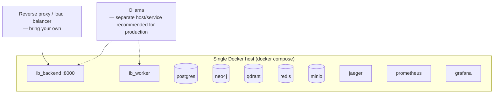

# Deployment Guide

Covers taking Industrial Brain OS from a developer machine to a
shared/production environment, the pre-launch checklist, and backup/restore
procedures.

> **Honest scope note**: this repository ships a verified **Docker Compose**
> topology for local/single-host deployment (`docker-compose.yml`) and a
> production-shaped **backend** container (`backend/Dockerfile`, multi-stage,
> non-root user). There is **no frontend Dockerfile, no Kubernetes manifests,
> and no cloud IaC (Terraform/CDK/etc.) in this repository yet** — the
> sections below tell you exactly what exists today and what you'd need to
> add for a specific target platform.

---

## 1. What Ships Today



- `backend/Dockerfile` builds a **multi-stage, non-root** image (`appuser`,
  uid 10001) used for both the API (`ib_backend`) and the Celery worker
  (`ib_worker`) — same image, different `command:` in `docker-compose.yml`.
- The frontend is a static Vite build (`pnpm run build` → `frontend/dist/`)
  with **no committed container** — serve it with any static-file server
  (nginx, Caddy, a CDN, or a simple `pnpm run preview` for smoke-testing).
- Ollama is expected to run as its own process/host — it is **not**
  containerized in `docker-compose.yml` in this repository. For production,
  run it on a GPU-equipped host and point `OLLAMA_HOST`/`OLLAMA_PORT` at it.

---

## 2. Deploying with Docker Compose (single host)

```bash
git clone <repo-url> industrial-brain && cd industrial-brain
cp .env.example .env
# Edit .env: set a real SECRET_KEY and rotate every default password.

docker compose build ib_backend ib_worker
docker compose up -d

cd backend && alembic upgrade head && cd ..
python scripts/init_infra.py

# Build and serve the frontend
cd frontend
pnpm install && pnpm run build
# Serve frontend/dist/ with your web server of choice, e.g.:
pnpm dlx serve -s dist -l 3000
```

Point your reverse proxy at:
- `/` → the built frontend (`frontend/dist/`)
- `/api/` → `ib_backend:8000`
- `/api/v1/chat/stream` (WebSocket) → `ib_backend:8000`, with WebSocket
  upgrade headers forwarded

### Adding a frontend container (if you need one)

There is no committed `frontend/Dockerfile`. A minimal one that fits this
project's build (`pnpm run build` outputs static files) looks like:

```dockerfile
FROM node:18-alpine AS build
WORKDIR /app
COPY frontend/package.json frontend/pnpm-lock.yaml ./
RUN corepack enable && pnpm install --frozen-lockfile
COPY frontend/ ./
COPY shared/ts /shared/ts
RUN pnpm run build

FROM nginx:alpine
COPY --from=build /app/dist /usr/share/nginx/html
EXPOSE 80
```

Add an `nginx.conf` that proxies `/api/` to `ib_backend:8000` (including
WebSocket upgrade headers for `/api/v1/chat/stream`) if you go this route.

---

## 3. Environment Configuration for Production

Beyond the local `.env` defaults (see `INSTALLATION.md` §7), for a shared
environment:

- `APP_ENV=production`, `APP_DEBUG=false`
- A real, random `SECRET_KEY` (32+ chars) — never reuse the placeholder
- Rotated `POSTGRES_PASSWORD`, `NEO4J_PASSWORD`, `REDIS_PASSWORD`,
  `MINIO_ROOT_PASSWORD`, `GRAFANA_ADMIN_PASSWORD`
- `OTEL_ENABLED=true` with `OTEL_EXPORTER_OTLP_ENDPOINT` pointed at your
  Jaeger/OTel collector
- Restrict `CORSMiddleware`'s `allow_origins=["*"]` in `backend/app/main.py`
  to your actual frontend origin(s) before going live — this is currently
  wide-open for local development.
- Put PostgreSQL, Neo4j, Qdrant, Redis, and MinIO on persistent volumes /
  managed services rather than ephemeral compose volumes if you need data to
  survive a host rebuild.

---

## 4. Production Checklist

Verified in M20 (`docs/verification/m20_verification.md`,
`docs/bible_compliance.md`) — re-check these before any release:

- [ ] `bandit -r backend/app -ll` → 0 medium/high findings
- [ ] `pip-audit` reviewed — accept or fix any new advisory (see
      `docs/bible_compliance.md` for the currently-accepted ML-dependency
      exceptions)
- [ ] `pnpm audit --audit-level high` (frontend) → 0 high findings
- [ ] All secrets sourced from environment/secret manager, never committed
      (`.env` gitignored — verify with `git check-ignore .env`)
- [ ] `docker compose up` (fresh volumes) reaches all-healthy in a
      reasonable window — verified in this repo as part of M20
- [ ] `make test` green (385+ tests) and `make coverage` reviewed
      (baseline: 77% — see `docs/bible_compliance.md` for the accepted gap)
- [ ] `make eval` — hallucination rate ≤ 0.15 (the CI gate threshold)
- [ ] `make benchmark` — semantic search p50 < 500ms; chat p50 depends on
      whether Ollama has GPU access (CPU-only will be far slower — budget
      accordingly, see `ADMIN_GUIDE.md` §3)
- [ ] `CORSMiddleware` origins restricted to real frontend origin(s)
- [ ] Default admin password (§`ADMIN_GUIDE.md`) rotated or account disabled
- [ ] Grafana default credentials rotated
- [ ] Reverse proxy / TLS termination in front of the backend and frontend
- [ ] Backup procedure (§5 below) tested at least once, not just documented

---

## 5. Backup and Restore

Each data store needs its own backup strategy — there is no unified backup
tool in this repository; use each store's standard mechanism.

### PostgreSQL (metadata, jobs, work orders, RCA sessions, evaluation runs)

```bash
# Backup
docker exec ib_postgres pg_dump -U postgres industrial_brain > backup_$(date +%Y%m%d).sql

# Restore (into a fresh/empty database)
cat backup_20260704.sql | docker exec -i ib_postgres psql -U postgres industrial_brain
```

### Neo4j (Knowledge Graph)

```bash
# Backup (Community edition — offline dump; stop writes first for consistency)
docker exec ib_neo4j neo4j-admin database dump neo4j --to-path=/backups
docker cp ib_neo4j:/backups/neo4j.dump ./neo4j_backup_$(date +%Y%m%d).dump

# Restore
docker cp ./neo4j_backup_20260704.dump ib_neo4j:/backups/neo4j.dump
docker exec ib_neo4j neo4j-admin database load neo4j --from-path=/backups --overwrite-destination=true
```

### Qdrant (vector embeddings)

Qdrant vectors are **fully derived from the source documents** (re-embeddable
— see `DEVELOPER_GUIDE.md` §7), so the simplest "backup" is keeping MinIO
(the source files) intact and re-running ingestion. For a direct snapshot:

```bash
curl -X POST http://localhost:6333/collections/document_chunks/snapshots
# Snapshot files are written under Qdrant's storage volume — back up the
# `qdrant_data` Docker volume directly for a full copy.
```

### MinIO (original source documents)

```bash
# Using the MinIO client (mc)
mc mirror local/industrial-brain-documents ./minio_backup_$(date +%Y%m%d)/
```

Or back up the underlying `minio_data` Docker volume directly.

### Redis (cache, chat history, Celery queue)

Redis here holds **transient state only** (cache with TTLs, chat history with
a TTL, in-flight Celery jobs) — it is not a system of record and does not
need backing up. If a Celery job is mid-flight during a Redis loss, the
corresponding `jobs` row in PostgreSQL will simply need a manual retry
(`POST /documents/{id}/retry`).

### Full-volume approach (simplest, if acceptable)

If you can tolerate a brief write-pause, the simplest consistent backup is
stopping the stack and archiving all named volumes:

```bash
docker compose stop
docker run --rm -v industrial-brain_pg_data:/data -v $(pwd):/backup alpine \
  tar czf /backup/pg_data_$(date +%Y%m%d).tar.gz -C /data .
# repeat for neo4j_data, qdrant_data, minio_data
docker compose start
```

Restore by extracting the corresponding archive back into a fresh named
volume before `docker compose up`.

**Test your restore procedure before you need it.** An untested backup is not
a backup.
