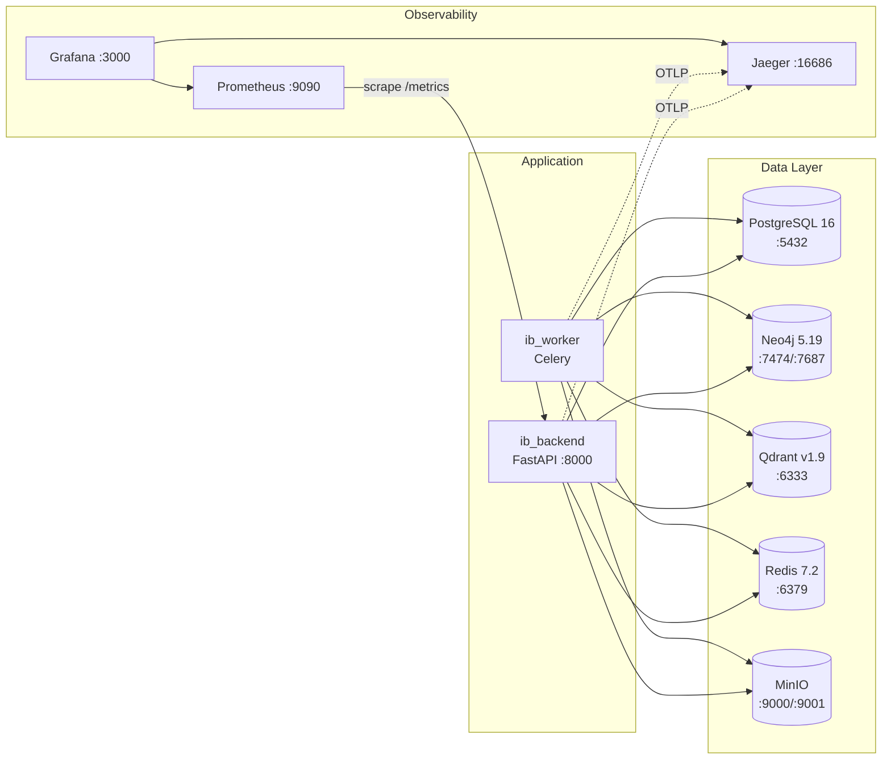

# Installation Guide

This guide takes a new engineer from a clean machine to a fully running
Industrial Brain OS stack: infrastructure, backend API, Celery worker,
frontend console, local LLM, and the optional developer-productivity tooling
(RepoWise, Claude Code, RuFlo) used by the original team.

> Verified against `feature/bootstrap` @ `6ad263a`. All commands below were run
> against the actual repository — paths, ports, and defaults match
> `docker-compose.yml`, `backend/requirements.txt`, `frontend/package.json`,
> and `backend/app/infrastructure/config/settings.py`.

---

## 1. Prerequisites

| Requirement | Minimum version | Verified with |
|---|---|---|
| **Python** | 3.9 – 3.12 (project venv uses 3.9.13; CI targets 3.9) | `python --version` |
| **Node.js** | 18+ | `node --version` |
| **pnpm** | 8+ (repo tested with 11.9.0) | `pnpm --version` |
| **Docker Desktop / Docker Engine** | with Docker Compose v2 | `docker compose version` |
| **Git** | any recent version | `git --version` |
| **RAM** | 16 GB recommended (embedding + reranker + LLM models are loaded in-process) | — |
| **Disk** | ~10 GB free (Docker images + HuggingFace model cache + Ollama models) | — |

Platform-specific extras are called out in each OS section below.

---

## 2. Required Software

| Software | Why it's needed | Install source |
|---|---|---|
| Docker Compose | PostgreSQL, Neo4j, Qdrant, Redis, MinIO, Jaeger, Prometheus, Grafana | [docker.com](https://www.docker.com/products/docker-desktop/) |
| Ollama | Local LLM inference (`llama3.2`) for chat, brain agents, and the evaluation judge | [ollama.com](https://ollama.com/download) |
| Python + pip | FastAPI backend, Celery worker, all `scripts/*.py` tooling | [python.org](https://www.python.org/downloads/) |
| Node.js + pnpm | React/Vite frontend | [nodejs.org](https://nodejs.org/), `npm install -g pnpm` |
| Alembic (installed via `requirements.txt`) | PostgreSQL schema migrations | included in `pip install -r backend/requirements.txt` |

No GPU is required — the reranker (`BAAI/bge-reranker-large`), LLMLingua
compressor, and Ollama all run on CPU in this project's default configuration
(`LLMLINGUA_DEVICE=cpu`). A GPU will make chat/RAG latency dramatically better
but is not required to run the system.

---

## 3. Clone the Repository

```bash
git clone <your-fork-or-origin-url> industrial-brain
cd industrial-brain
```

---

## 4. Installation — Windows

Tested on Windows 11 with PowerShell.

```powershell
# 1. Install Docker Desktop, enable WSL2 backend, and start it.

# 2. Install Python 3.9+ and Node.js 18+ (from official installers), then:
npm install -g pnpm

# 3. Create and activate the backend virtual environment
cd backend
python -m venv venv
venv\Scripts\Activate.ps1
pip install -r requirements.txt
pip install -e ..\shared\python
cd ..

# 4. Install frontend dependencies
cd frontend
pnpm install
cd ..

# 5. Copy the environment template
copy .env.example .env

# 6. Start infrastructure
docker compose up -d

# 7. Apply database migrations
cd backend
alembic upgrade head
cd ..

# 8. Initialise Qdrant collections / Neo4j constraints / MinIO buckets
python scripts/init_infra.py
```

A PowerShell task runner is also provided (`run.ps1`) with a reduced command
set — `./run.ps1 -Action install`, `-Action up`, `-Action lint`,
`-Action format`, `-Action test`. It does not (yet) expose the newer `make`
targets added in M16–M20 (`eval`, `validate-prompts`, `demo-data`,
`security-audit`, `benchmark`, `coverage`) — for those, run the underlying
`python scripts/*.py` command directly, or use WSL/Git Bash with `make`.

### Windows-specific notes

- Prefer **Git Bash** or **WSL2** for anything that mixes shell scripting
  (some project scripts assume POSIX paths).
- If `pip install` fails with an SSL certificate error (common behind
  corporate proxies / SSL-inspecting networks), retry with:
  ```powershell
  pip install --trusted-host pypi.org --trusted-host files.pythonhosted.org -r requirements.txt
  ```
- pytest's temp-directory fixtures can fail with `PermissionError: [WinError 5]`
  on some Windows home directories. Work around it with an explicit basetemp:
  ```powershell
  pytest --basetemp=C:\temp\pytest-tmp
  ```

---

## 5. Installation — Linux (Debian/Ubuntu example)

```bash
# 1. Docker
sudo apt-get update && sudo apt-get install -y docker.io docker-compose-plugin
sudo usermod -aG docker $USER   # log out/in after this

# 2. Python + Node
sudo apt-get install -y python3 python3-venv python3-pip
curl -fsSL https://deb.nodesource.com/setup_18.x | sudo -E bash -
sudo apt-get install -y nodejs
npm install -g pnpm

# 3. Backend
cd backend
python3 -m venv venv
source venv/bin/activate
pip install -r requirements.txt
pip install -e ../shared/python
cd ..

# 4. Frontend
cd frontend && pnpm install && cd ..

# 5. Environment
cp .env.example .env

# 6. Infrastructure
docker compose up -d

# 7. Migrations + infra init
cd backend && alembic upgrade head && cd ..
python scripts/init_infra.py
```

### Linux-specific notes

- If Docker requires `sudo` for every command, either keep using `sudo` or
  finish the `usermod -aG docker` step above and restart your session.
- Ollama on Linux runs as a systemd service after install; verify with
  `systemctl status ollama` or simply `curl http://127.0.0.1:11434/api/version`.

---

## 6. Installation — macOS

```bash
# 1. Homebrew prerequisites
brew install python@3.11 node docker docker-compose git
brew install pnpm

# 2. Docker Desktop for Mac must be started manually (brew installs the CLI/cask
#    but the app needs to be launched once from Applications).

# 3. Backend
cd backend
python3 -m venv venv
source venv/bin/activate
pip install -r requirements.txt
pip install -e ../shared/python
cd ..

# 4. Frontend
cd frontend && pnpm install && cd ..

# 5. Environment
cp .env.example .env

# 6. Infrastructure
docker compose up -d

# 7. Migrations + infra init
cd backend && alembic upgrade head && cd ..
python scripts/init_infra.py
```

### macOS-specific notes

- Apple Silicon (M1/M2/M3): all Docker images used here (`postgres:16-alpine`,
  `neo4j:5.19-community`, `qdrant/qdrant:v1.9.0`, `redis:7.2-alpine`,
  `minio/minio:latest`) ship multi-arch manifests and run natively under
  Docker Desktop for Mac.
- `paddleocr`/`paddlepaddle` (used for scanned-document OCR) can be slow to
  build from source on Apple Silicon; if `pip install` struggles, install
  everything else first and revisit that one package separately.

---

## 7. Environment Variables

Copy `.env.example` to `.env` and adjust as needed. All variables are consumed
by `backend/app/infrastructure/config/settings.py` (a Pydantic `Settings`
class) — anything not set falls back to the default shown below.

### Application

| Variable | Default | Purpose |
|---|---|---|
| `APP_ENV` | `development` | Environment name (surfaced in logs/headers) |
| `APP_DEBUG` | `true` | Debug flag |
| `SECRET_KEY` | placeholder — **replace in any non-local environment** | JWT signing key |
| `LOG_LEVEL` | `INFO` | Root logger level |
| `BACKEND_PORT` | `8000` | Uvicorn port |
| `BACKEND_HOST` | `0.0.0.0` (compose) / `127.0.0.1` (default) | Uvicorn bind host |

### PostgreSQL

| Variable | Default |
|---|---|
| `POSTGRES_DB` | `industrial_brain` |
| `POSTGRES_USER` | `postgres` |
| `POSTGRES_PASSWORD` | `postgres_dev_password` |
| `POSTGRES_HOST` | `127.0.0.1` (`postgres` inside compose) |
| `POSTGRES_PORT` | `5432` |

### Neo4j (Knowledge Graph)

| Variable | Default |
|---|---|
| `NEO4J_USER` | `neo4j` |
| `NEO4J_PASSWORD` | `neo4j_dev_password` |
| `NEO4J_HOST` | `127.0.0.1` (`neo4j` inside compose) |
| `NEO4J_PORT` | `7474` (HTTP console) |
| `NEO4J_BOLT_PORT` | `7687` (driver protocol) |

### Qdrant (vectors)

| Variable | Default |
|---|---|
| `QDRANT_HOST` | `127.0.0.1` (`qdrant` inside compose) |
| `QDRANT_PORT` | `6333` |

### Redis (cache, chat history, Celery broker)

| Variable | Default |
|---|---|
| `REDIS_HOST` | `127.0.0.1` (`redis` inside compose) |
| `REDIS_PORT` | `6379` |
| `REDIS_PASSWORD` | `redis_dev_password` |

### MinIO (object storage for source documents)

| Variable | Default |
|---|---|
| `MINIO_ROOT_USER` | `minioadmin` |
| `MINIO_ROOT_PASSWORD` | `minioadmin_dev_password` |
| `MINIO_HOST` | `127.0.0.1` (`minio` inside compose) |
| `MINIO_PORT` | `9000` |
| `MINIO_CONSOLE_PORT` | `9001` |
| `MINIO_BUCKET_NAME` | `industrial-brain-documents` |

### LLM / Chat

| Variable | Default | Notes |
|---|---|---|
| `LLM_PROVIDER` | `ollama` | `ollama` \| `gemini` |
| `OLLAMA_HOST` | `127.0.0.1` | |
| `OLLAMA_PORT` | `11434` | |
| `OLLAMA_MODEL` | `llama3.2` | Must be pulled locally — see §9 |
| `GEMINI_API_KEY` | *(empty)* | Only needed if `LLM_PROVIDER=gemini` |
| `GEMINI_MODEL` | `gemini-2.0-flash` | |
| `CHAT_MAX_TOKENS` | `2048` | |
| `CHAT_SESSION_TTL_SECONDS` | `3600` | Redis chat-history TTL |

### GraphRAG / retrieval

| Variable | Default | Notes |
|---|---|---|
| `GRAPHRAG_RERANKER_MODEL` | `BAAI/bge-reranker-large` | Downloaded from HuggingFace on first use |
| `GRAPHRAG_CACHE_TTL_SECONDS` | `300` | Redis GraphRAG result cache |
| `GRAPHRAG_TOKEN_BUDGET` | `6000` | Context budget fed to the LLM |
| `GRAPHRAG_MAX_KG_DEPTH` | `2` | Bounded Neo4j traversal depth |
| `GRAPHRAG_KG_TRAVERSAL_LIMIT` | `50` | Bounded edge count |
| `GRAPHRAG_COMPRESSION_ENABLED` | `true` | Stage-7 LLMLingua compression |
| `GRAPHRAG_COMPRESSION_RATIO` | `0.7` | Target fraction of tokens kept |
| `GRAPHRAG_COMPRESSION_MIN_TOKENS` | `2000` | Below this, compression is skipped |
| `LLMLINGUA_MODEL` | `microsoft/llmlingua-2-bert-base-multilingual-cased-meetingbank` | |
| `LLMLINGUA_DEVICE` | `cpu` | `cpu` \| `cuda` |

### Ingestion (Celery)

| Variable | Default |
|---|---|
| `INGESTION_BACKEND` | `celery` (legacy: `redis-queue`) |
| `CELERY_BROKER_DB` | `1` (Redis logical DB) |
| `CELERY_RESULT_DB` | `2` |
| `CELERY_WORKER_CONCURRENCY` | `2` |

### Observability (M17)

| Variable | Default |
|---|---|
| `OTEL_ENABLED` | `false` (compose sets `true` for `ib_backend`/`ib_worker`) |
| `OTEL_SERVICE_NAME` | `industrial-brain-api` |
| `OTEL_EXPORTER_OTLP_ENDPOINT` | `http://localhost:4318` (`http://jaeger:4318` in compose) |

### Evaluation (M16)

| Variable | Default |
|---|---|
| `EVAL_GOLDEN_DATASET` | `datasets/golden_qa.json` |
| `EVAL_TOP_K` | `10` |
| `EVAL_JUDGE_MAX_TOKENS` | `64` |
| `EVAL_HALLUCINATION_THRESHOLD` | `0.15` (CI merge gate) |

> **Never commit a populated `.env`.** It is already listed in `.gitignore`.
> In any shared or production environment, generate a real 32+ character
> `SECRET_KEY` and rotate the default database/Redis/MinIO passwords.

---

## 8. Docker Setup

`docker-compose.yml` defines the full infrastructure stack:



Bring everything up:

```bash
docker compose up -d
```

| Service | Container | Port(s) | Purpose |
|---|---|---|---|
| `postgres` | `ib_postgres` | 5432 | Core relational metadata (users, documents, jobs, work orders, RCA sessions, evaluation runs) |
| `neo4j` | `ib_neo4j` | 7474 (HTTP), 7687 (Bolt) | Industrial Knowledge Graph |
| `qdrant` | `ib_qdrant` | 6333 | Dense vector search |
| `redis` | `ib_redis` | 6379 | Cache, chat history, Celery broker/result backend |
| `minio` | `ib_minio` | 9000 (API), 9001 (console) | Object storage for source documents |
| `ib_backend` | `ib_backend` | 8000 | FastAPI application (built from `backend/Dockerfile`) |
| `ib_worker` | `ib_worker` | — | Celery ingestion worker (same image as `ib_backend`) |
| `jaeger` | `ib_jaeger` | 16686 (UI), 4317/4318 (OTLP) | Distributed tracing (M17) |
| `prometheus` | `ib_prometheus` | 9090 | Metrics scraping (M17) |
| `grafana` | `ib_grafana` | 3000 | Dashboards (M17) — **note:** this is the same port the Vite dev server defaults to; stop Grafana or change one port when running the frontend dev server locally alongside it |

Check status and health:

```bash
docker compose ps
docker compose logs -f ib_backend
```

Tear down (keep volumes):

```bash
docker compose down
```

Tear down and wipe all data (fresh start):

```bash
docker compose down -v
```

---

## 9. Ollama Setup

Ollama provides the local LLM used for chat, all five brain agents, and the
M16 evaluation judge.

### Install

- **Windows / macOS**: download the installer from
  [ollama.com/download](https://ollama.com/download) and run it — it installs
  the `ollama` CLI and starts the background server automatically.
- **Linux**:
  ```bash
  curl -fsSL https://ollama.com/install.sh | sh
  ```

### Verify the installation

```bash
ollama --version
```

### Start the server (if not already running)

The installer normally starts the server automatically as a background
service. If it isn't running:

```bash
ollama serve
```

### Verify the server is reachable

```bash
curl http://127.0.0.1:11434/api/version
# {"version":"0.31.1"}  (version will vary)
```

---

## 10. Required AI Models

| Model | Where it's used | How it's obtained |
|---|---|---|
| `llama3.2` (Ollama) | Chat copilot, all 5 brain agents, evaluation judge | `ollama pull llama3.2` |
| `BAAI/bge-reranker-large` (HuggingFace, via `sentence-transformers`) | Stage 6 cross-encoder reranking in the GraphRAG pipeline | Downloaded automatically on first use (cached under `~/.cache/huggingface`) |
| `microsoft/llmlingua-2-bert-base-multilingual-cased-meetingbank` (HuggingFace, via `llmlingua`) | Stage 7 context compression | Downloaded automatically on first use |
| `en_core_web_sm` (spaCy) | Entity extraction for the Knowledge Graph (M7) | `python -m spacy download en_core_web_sm` |

Pull the Ollama model:

```bash
ollama pull llama3.2
```

Verify it loads and runs inference:

```bash
curl http://127.0.0.1:11434/api/generate -d '{"model": "llama3.2", "prompt": "Reply with exactly one word: OK", "stream": false}'
```

Both the reranker and LLMLingua models are **lazy-loaded on first use** by the
backend (not at startup) and **degrade gracefully to a pass-through** if the
model cannot be downloaded or loaded — the retrieval pipeline never hard-fails
because of a missing model. First use will be slow (multi-second to
~1 minute) while the model downloads and loads into memory; subsequent calls
are fast because the model stays resident in the backend process.

Install the spaCy model:

```bash
python -m spacy download en_core_web_sm
```

---

## 11. RepoWise Setup (optional developer tooling)

[RepoWise](https://repowise.dev) is a codebase-intelligence tool the original
team used during development (architecture Q&A, dependency graphs, dead-code
detection, risk analysis). **It is not required to run the application** —
it's an IDE/AI-assistant productivity layer, and its local state
(`.repowise/`, `.repowise-workspace.yaml`) is untracked (not part of the git
repository).

To set it up:

1. Install the RepoWise CLI (see [repowise.dev](https://repowise.dev) for the
   current install method for your platform).
2. Index this repository:
   ```bash
   repowise index D:/industrial-brain   # or your local path
   ```
3. Register it as an MCP server for Claude Code / any MCP-compatible client
   by adding to `.mcp.json` at the repo root:
   ```json
   {
     "mcpServers": {
       "repowise": {
         "command": "repowise",
         "args": ["mcp", "D:/industrial-brain", "--transport", "stdio"],
         "description": "repowise: codebase intelligence — docs, graph, git signals, dead code, decisions"
       }
     }
   }
   ```
4. Re-index after a batch of commits: `repowise index --update`.

If you don't use RepoWise, ignore this section entirely — every other part of
this manual is self-contained.

---

## 12. Claude Code Setup (optional developer tooling)

[Claude Code](https://claude.com/claude-code) is Anthropic's CLI coding agent.
This repository ships an (untracked, local-only) `.claude/` directory used
during development for project-specific instructions, custom skills, and
permission settings. To use Claude Code on this project:

1. Install Claude Code per the
   [official documentation](https://docs.claude.com/claude-code).
2. From the repo root, run `claude` to start an interactive session — it will
   automatically read `CLAUDE.md` (project instructions, checked into the
   repo) for architecture rules and source-of-truth pointers.
3. Optional: if you use the RepoWise MCP server (§11), Claude Code will pick
   it up automatically from `.mcp.json`.
4. Project conventions that Claude Code (or any contributor) should follow are
   documented in `docs/engineering_bible.md` and
   `docs/architecture_decision_records.md` — read those before making
   architectural changes.

This is a productivity aid, not a runtime dependency — none of the
application code depends on it.

---

## 13. RuFlo / Claude-Flow Setup (optional developer tooling)

Some contributors used **RuFlo (Claude-Flow)** — a multi-agent orchestration
and memory layer for Claude Code — during development. Its artifacts
(`.claude-flow/`, `.swarm/`, `ruvector.db`) are untracked local state, not
part of the application.

If you want to use it:

1. Install per the tool's own instructions (typically `npx claude-flow init`
   or an equivalent bootstrap command run from the repo root).
2. It registers itself as an MCP toolset (`memory_store`, `memory_search`,
   `hooks_route`, `swarm_init`, `agent_spawn`, etc.) available to Claude Code.
3. It is entirely optional — the application, its tests, and its CI pipeline
   have no dependency on it. If you don't have it installed, ignore any
   `[INTELLIGENCE]`-style hints referencing it in a contributor's global
   Claude configuration; they don't apply to you.

---

## 14. Starting Everything

Once infrastructure, models, and dependencies are installed:

```bash
# 1. Infrastructure (Postgres, Neo4j, Qdrant, Redis, MinIO, + observability)
docker compose up -d

# 2. Ollama (if not already running as a service)
ollama serve &

# 3. Backend API
cd backend
venv\Scripts\Activate.ps1   # Windows, or: source venv/bin/activate
uvicorn app.main:app --reload

# 4. Celery worker (separate terminal, from backend/)
celery -A app.worker worker --loglevel=info

# 5. Frontend (separate terminal)
cd frontend
pnpm run dev
```

Then open:

- Frontend: **http://localhost:3000**
- Backend Swagger docs: **http://localhost:8000/docs**
- Backend health check: **http://localhost:8000/api/v1/health**
- Jaeger UI: **http://localhost:16686**
- Prometheus: **http://localhost:9090**
- Grafana: **http://localhost:3000** (conflicts with the frontend dev server —
  run one at a time locally, or change a port)

For the full request → subsystem flow and what each service does, see
[`ARCHITECTURE.md`](ARCHITECTURE.md). For day-to-day development tasks, see
[`DEVELOPER_GUIDE.md`](DEVELOPER_GUIDE.md).
