# Industrial Brain OS — End-to-End Validation Report

Autonomous, human-like browser validation of the running application using
**Playwright driving real Google Chrome**. Generated by `e2e/` (see that folder
for the suite). Re-run with `cd e2e && pnpm test && pnpm run report:build`.

- **[summary.md](summary.md)** — verdict, totals, per-suite + per-test results
- **[failures.md](failures.md)** — failing tests with errors + artifact paths
- **[warnings.md](warnings.md)** — non-fatal issues observed
- **[suggestions.md](suggestions.md)** — improvement opportunities
- **[performance.md](performance.md)** — captured timings
- **[coverage.md](coverage.md)** — requested-capability matrix
- **html-report/** — full interactive Playwright report (traces/videos inline; generated locally, git-ignored)
- **artifacts/** — per-test traces, videos, screenshots (generated locally, git-ignored)

## Verdict

✅ **PASS** — 31/31 tests passed · 325.1s · 6 warning(s) · 3 suggestion(s).

## Milestone screenshots

### 01-chat-connected.png

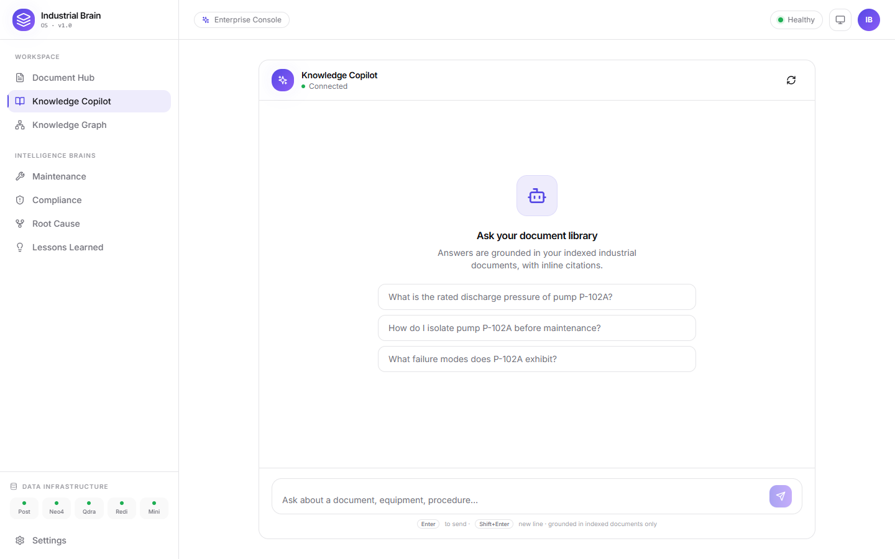

### 01-dark-mode.png

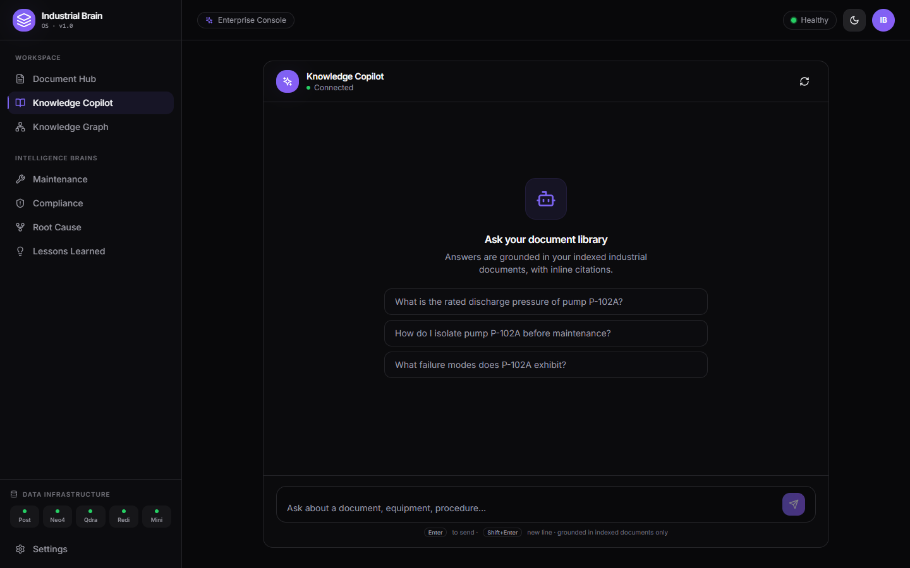

### 01-documents-library.png

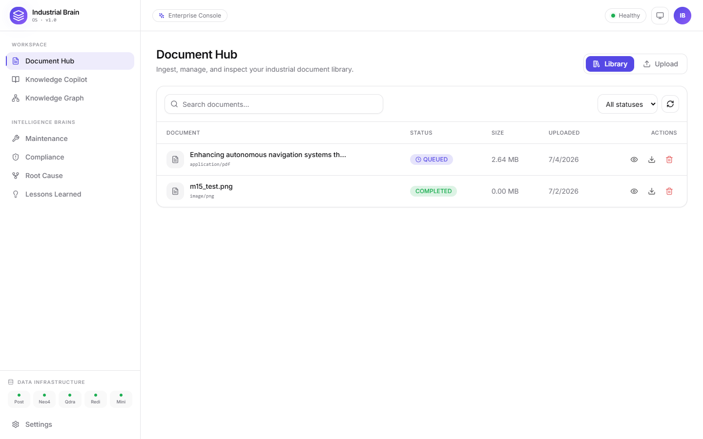

### 01-knowledge-graph.png

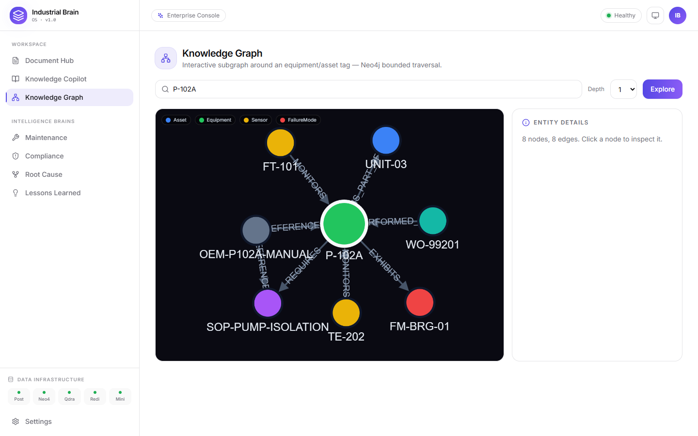

### 01-landing.png

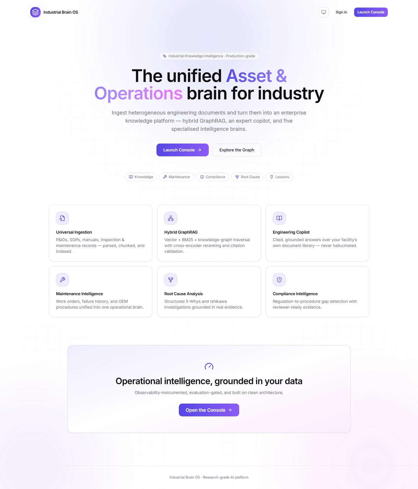

### 01-login-screen.png

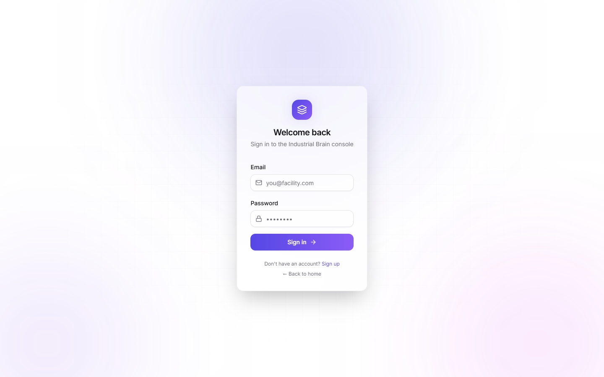

### 02-authenticated-dashboard.png

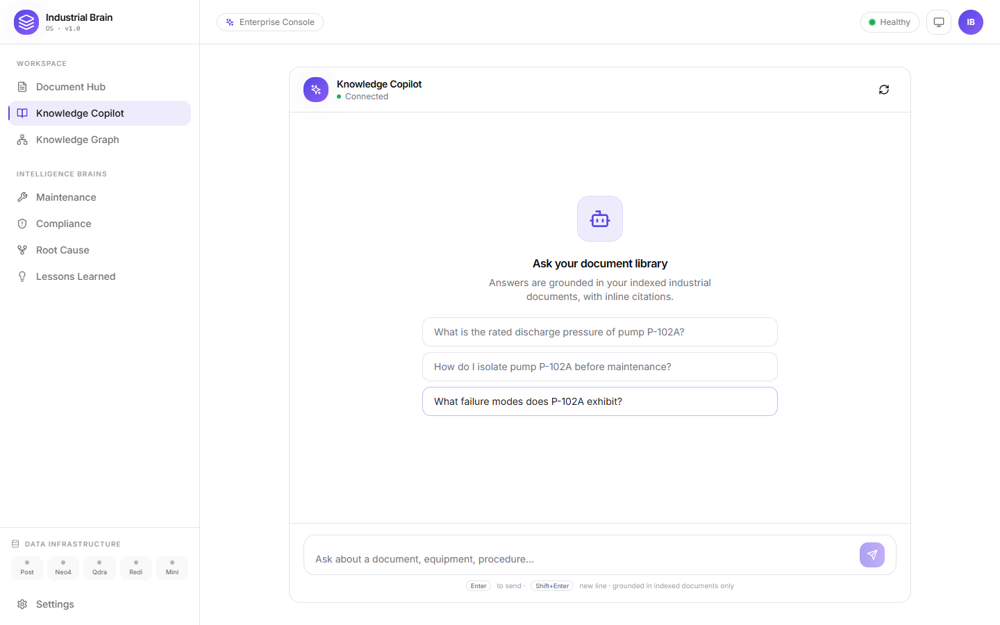

### 02-brain-maintenance.png

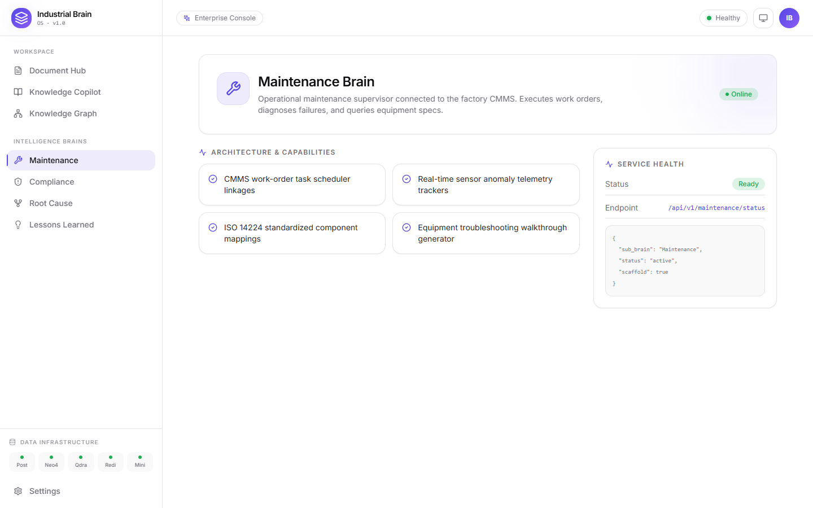

### 02-documents-upload-selected.png

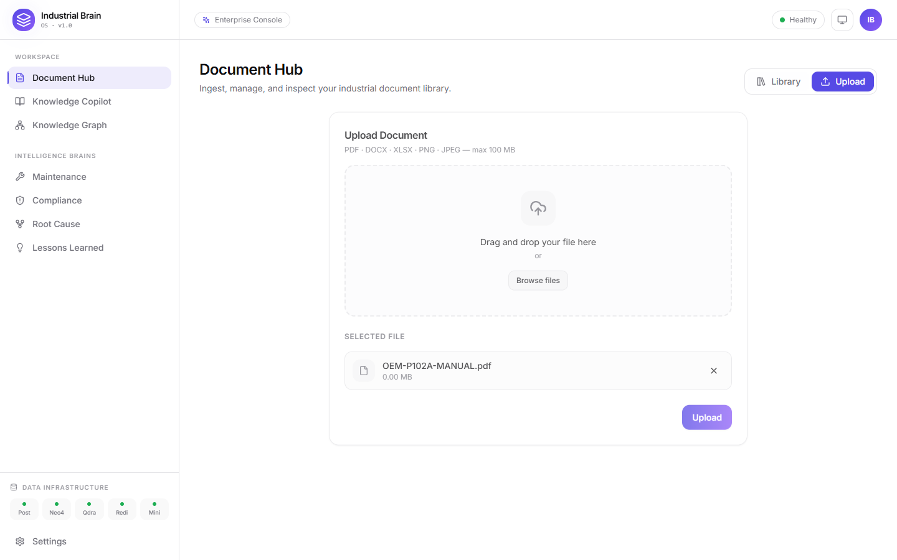

### 02-light-mode.png

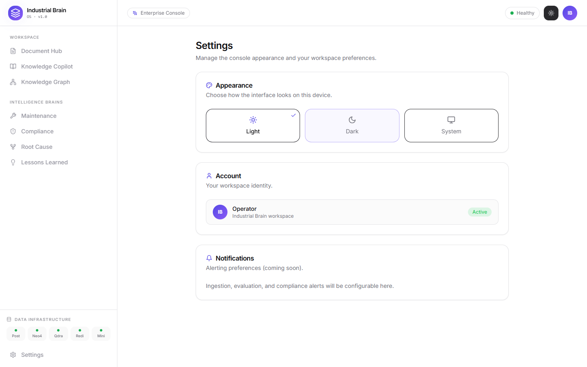

### 02-signup-duplicate.png

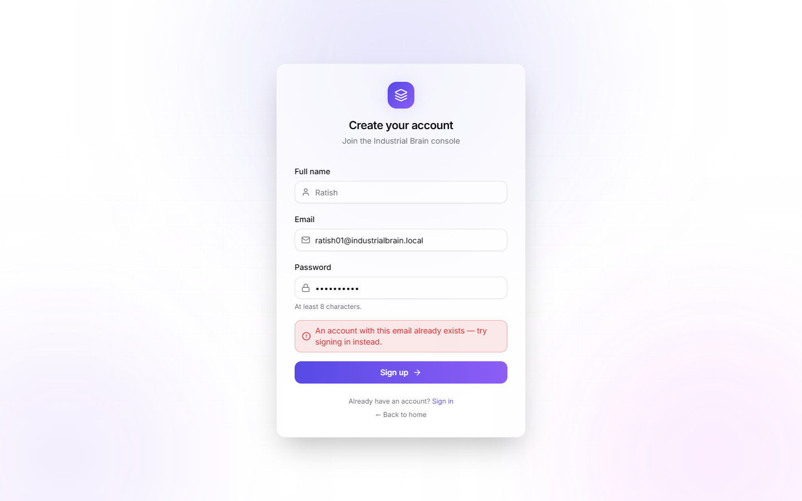

### 03-mobile-collapsed.png

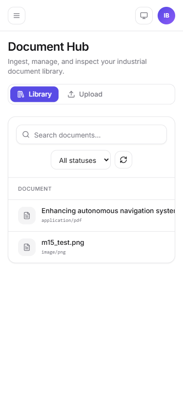

### 04-chat-answer.png

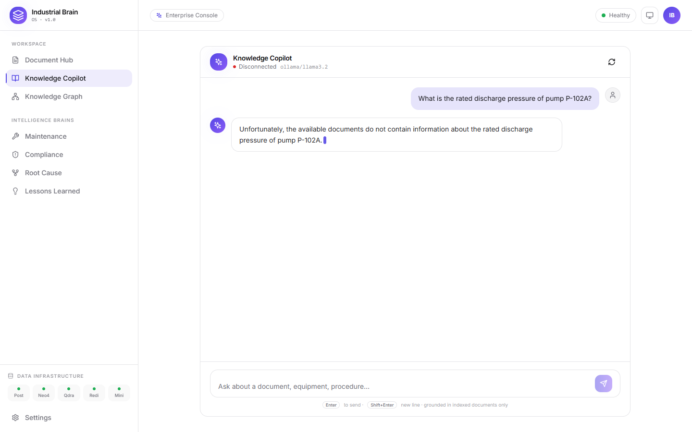

### 04-mobile-nav-open.png

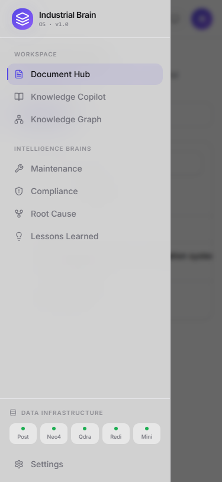

### 05-not-found-404.png

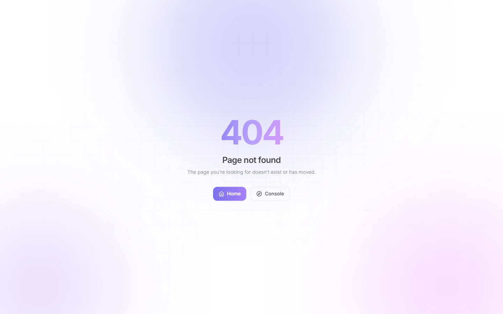
